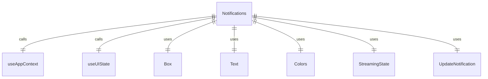
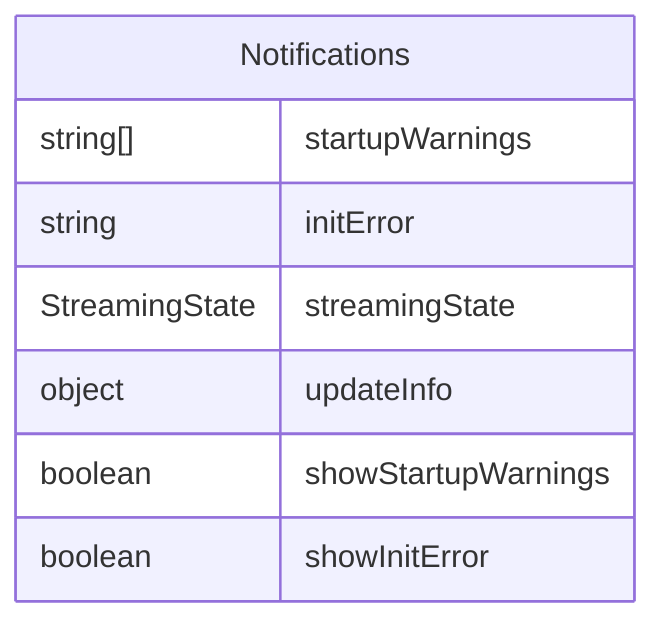

# Notifications.tsx

通知显示组件，用于显示应用程序的各种通知信息，包括启动警告、初始化错误和更新通知。

## 功能概述

1. 显示应用程序启动警告
2. 显示初始化错误信息
3. 显示更新通知
4. 根据条件动态显示不同类型的通知

## 组件结构

### Notifications
- 使用 React hooks 获取应用上下文和UI状态
- 根据条件判断是否显示各种通知
- 使用条件渲染显示不同类型的通知
- 包含 UpdateNotification 组件显示更新信息

## 状态管理

- 使用 `useAppContext` 获取启动警告信息
- 使用 `useUIState` 获取初始化错误、流状态和更新信息
- 计算是否显示启动警告和初始化错误的条件

## 条件渲染逻辑

- 当没有通知需要显示时返回 null
- 根据条件显示更新通知、启动警告或初始化错误
- 初始化错误仅在非响应状态下显示

## 通知类型

### 启动警告
- 显示在黄色边框容器中
- 支持显示多个警告信息

### 初始化错误
- 显示在红色边框容器中
- 包含错误信息和解决建议

### 更新通知
- 使用 UpdateNotification 组件显示
- 显示更新消息

## 依赖关系

- 依赖 `ink` 的 `Box` 和 `Text` 组件
- 依赖 `../contexts/AppContext.js` 的应用上下文 hook
- 依赖 `../contexts/UIStateContext.js` 的UI状态 hook
- 依赖 `../colors.js` 的颜色定义
- 依赖 `../types.js` 的 `StreamingState` 枚举
- 依赖 `./UpdateNotification.js` 的更新通知组件

## 函数级调用关系

## 变量级调用关系

