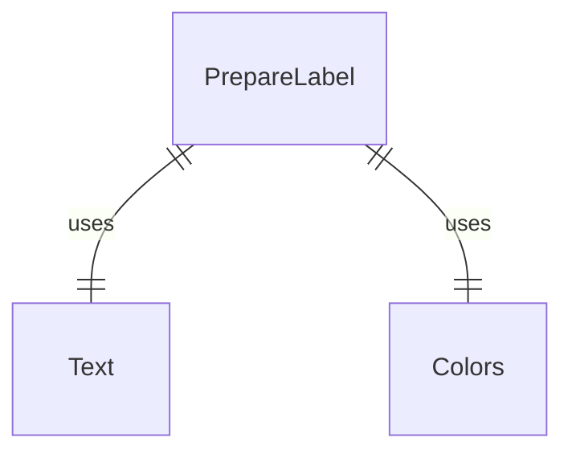
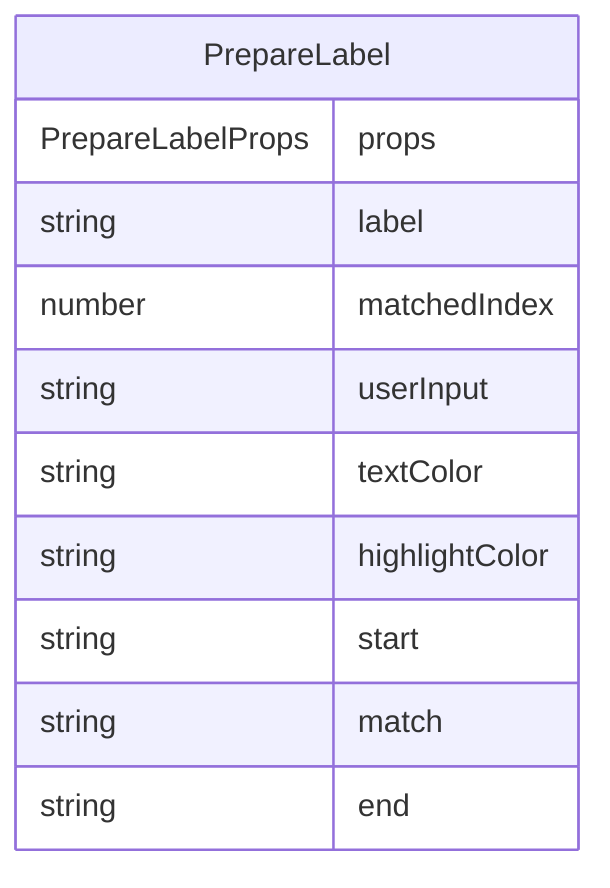

# PrepareLabel.tsx

准备标签组件，用于在自动完成和命令建议中高亮显示匹配的文本部分。

## 功能概述

1. 高亮显示标签中与用户输入匹配的部分
2. 支持自定义文本颜色和高亮颜色
3. 处理边界情况（无匹配、索引越界等）

## 组件结构

### PrepareLabel
- 接收标签文本、匹配索引、用户输入等属性
- 根据匹配索引和用户输入分割标签文本
- 使用不同颜色渲染匹配部分和非匹配部分
- 处理无效匹配索引的情况

## 接口定义

### PrepareLabelProps
- `label`: 标签文本
- `matchedIndex`: 匹配索引（可选）
- `userInput`: 用户输入文本
- `textColor`: 文本颜色
- `highlightColor`: 高亮颜色（可选，默认为黄色）

## 渲染逻辑

1. **边界情况处理**：
   - 当匹配索引未定义、小于0、超出标签长度或用户输入为空时，直接渲染整个标签

2. **文本分割**：
   - 将标签文本按匹配索引和用户输入长度分割为三部分：开始部分、匹配部分、结束部分

3. **高亮渲染**：
   - 开始部分和结束部分使用指定文本颜色
   - 匹配部分使用黑色文字和指定高亮背景色，并加粗显示

## 依赖关系

- 依赖 `react` 和 `ink` 的 `Text` 组件
- 依赖 `../colors.js` 的颜色定义

## 函数级调用关系

## 变量级调用关系

