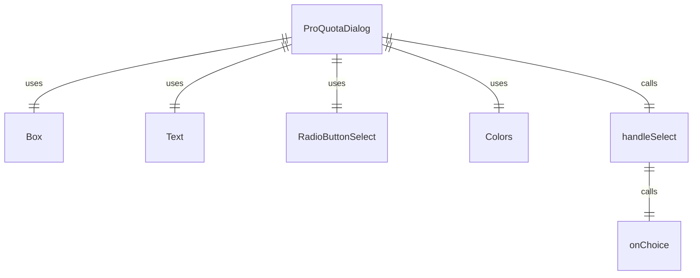
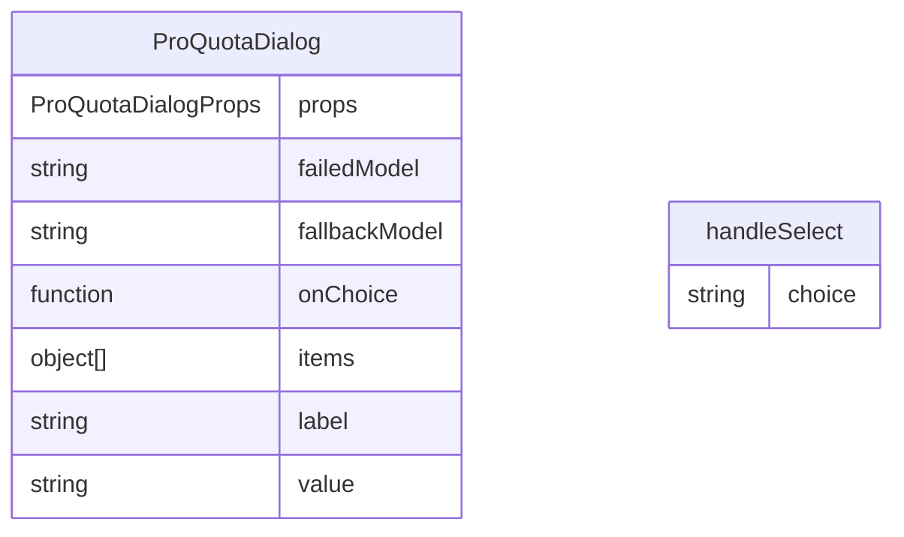

# ProQuotaDialog.tsx

专业配额对话框组件，用于在达到专业配额限制时向用户显示选择选项。

## 功能概述

1. 显示专业配额限制通知
2. 提供两个选择选项：更改认证或继续使用备用模型
3. 处理用户选择并回调父组件

## 组件结构

### ProQuotaDialog
- 接收失败模型、备用模型和选择回调函数作为属性
- 使用 RadioButtonSelect 组件显示选择选项
- 显示配额限制警告信息
- 处理用户选择并调用回调函数

## 接口定义

### ProQuotaDialogProps
- `failedModel`: 达到配额限制的模型名称
- `fallbackModel`: 备用模型名称
- `onChoice`: 用户选择后的回调函数

## 选择选项

1. **更改认证**：
   - 标签：'Change auth (executes the /auth command)'
   - 值：'auth'

2. **继续使用备用模型**：
   - 标签：`Continue with ${fallbackModel}`
   - 值：'continue'

## 事件处理

- 使用 `handleSelect` 函数处理 RadioButtonSelect 的选择事件
- 调用 `onChoice` 回调函数传递用户选择

## 依赖关系

- 依赖 `react` 和 `ink` 组件
- 依赖 `./shared/RadioButtonSelect.js` 的单选按钮组件
- 依赖 `../colors.js` 的颜色定义

## 函数级调用关系

## 变量级调用关系

