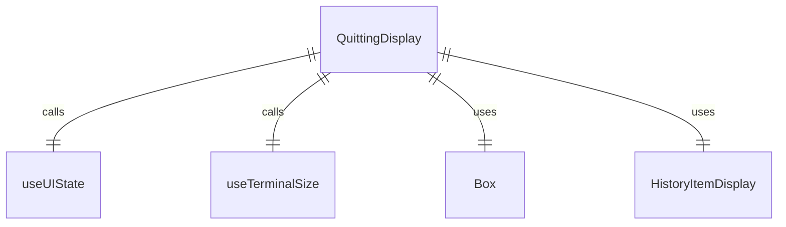
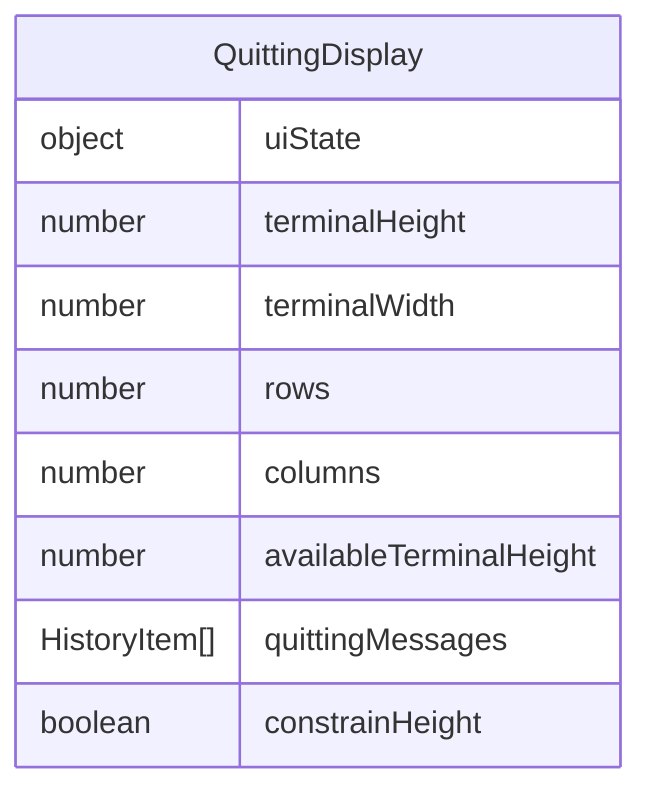

# QuittingDisplay.tsx

退出显示组件，用于在应用程序退出时显示最后的消息历史记录。

## 功能概述

1. 在应用程序退出时显示消息历史记录
2. 根据终端尺寸调整显示内容
3. 使用 HistoryItemDisplay 组件渲染每条消息

## 组件结构

### QuittingDisplay
- 使用 React hooks 获取 UI 状态和终端尺寸
- 条件渲染退出消息
- 遍历退出消息数组并渲染 HistoryItemDisplay 组件

## 状态管理

- 使用 `useUIState` 获取 UI 状态，包括退出消息
- 使用 `useTerminalSize` 获取终端尺寸信息
- 计算可用终端高度

## 条件渲染

- 当 `uiState.quittingMessages` 不存在时返回 null
- 根据 `uiState.constrainHeight` 决定是否限制历史记录项的高度

## 依赖关系

- 依赖 `ink` 的 `Box` 组件
- 依赖 `../contexts/UIStateContext.js` 的 UI 状态上下文 hook
- 依赖 `./HistoryItemDisplay.js` 的历史记录项显示组件
- 依赖 `../hooks/useTerminalSize.js` 的终端尺寸 hook

## 函数级调用关系

## 变量级调用关系

