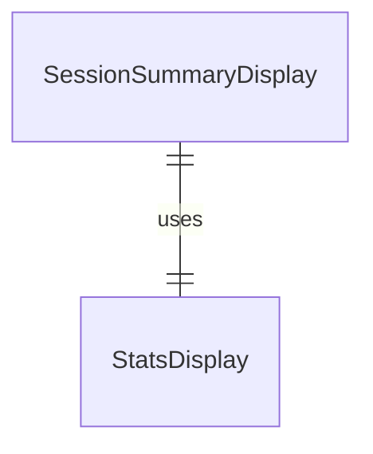
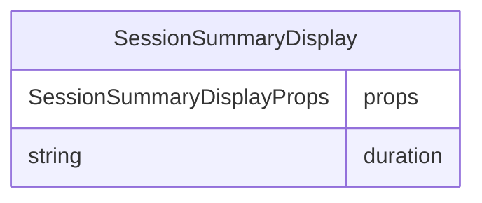

# SessionSummaryDisplay.tsx

会话摘要显示组件，用于在会话结束时显示会话摘要信息。

## 功能概述

1. 显示会话结束信息
2. 显示会话持续时间
3. 使用 StatsDisplay 组件渲染摘要信息

## 组件结构

### SessionSummaryDisplay
- 接收会话持续时间作为属性
- 使用 StatsDisplay 组件显示会话摘要
- 设置标题为"Agent powering down. Goodbye!"

## 接口定义

### SessionSummaryDisplayProps
- `duration`: 会话持续时间字符串

## 依赖关系

- 依赖 `react`
- 依赖 `./StatsDisplay.js` 的 StatsDisplay 组件

## 函数级调用关系

## 变量级调用关系

