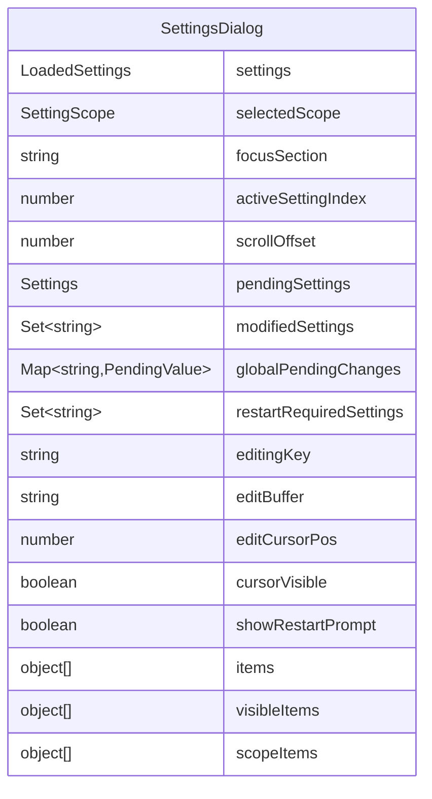

# SettingsDialog.tsx

设置对话框组件，用于显示和修改应用程序的各种设置选项。

## 功能概述

1. 显示所有可配置的设置选项
2. 支持布尔值、数字、字符串和枚举类型的设置
3. 支持用户和工作区两种作用域
4. 实时编辑和保存设置
5. 显示需要重启才能生效的设置提示

## 组件结构

### SettingsDialog
- 使用 React hooks 管理复杂的状态
- 实现键盘交互处理
- 支持设置的实时编辑和保存
- 显示作用域选择器
- 处理需要重启的设置

## 状态管理

### 主要状态变量
- `focusSection`: 当前焦点区域（'settings' 或 'scope'）
- `selectedScope`: 选定的作用域（用户或工作区）
- `activeSettingIndex`: 活动设置项的索引
- `scrollOffset`: 设置列表的滚动偏移量
- `pendingSettings`: 当前作用域的待定设置
- `modifiedSettings`: 已修改的设置集合
- `globalPendingChanges`: 跨作用域的待定更改
- `restartRequiredSettings`: 需要重启的设置集合

### 编辑状态
- `editingKey`: 正在编辑的设置键
- `editBuffer`: 编辑缓冲区
- `editCursorPos`: 编辑光标位置
- `cursorVisible`: 光标可见性（用于闪烁效果）

## 键盘交互

### 设置区域按键处理
- 方向键/字母键：导航设置项
- Enter/Space：选择或切换设置
- 数字键：直接输入数字设置值
- Ctrl+C/Ctrl+L：重置设置为默认值
- Escape：退出编辑模式或关闭对话框

### 编辑模式按键处理
- Backspace/Delete：删除字符
- 左右箭头：移动光标
- Home/End：移动到行首/行尾
- Escape：提交编辑
- Enter：提交编辑

## 设置类型处理

### 布尔值设置
- 使用 toggle 方法切换值
- 立即保存不需要重启的设置

### 数字设置
- 支持实时编辑
- 验证输入为有效数字
- 立即保存不需要重启的设置

### 字符串设置
- 支持实时编辑
- 过滤不安全字符
- 立即保存不需要重启的设置

### 枚举设置
- 循环选择枚举选项
- 立即保存不需要重启的设置

## 作用域管理

- 支持用户和工作区两种作用域
- 跨作用域保持待定更改
- 显示设置的作用域信息

## 重启提示

- 检测需要重启的设置更改
- 显示重启提示信息
- 按 'r' 键保存并重启应用

## 依赖关系

- 依赖 `react` 和 `ink` 组件
- 依赖 `../colors.js` 的颜色定义
- 依赖 `../../config/settings.js` 的设置类型和作用域
- 依赖 `../../utils/dialogScopeUtils.js` 的作用域工具函数
- 依赖 `../../utils/settingsUtils.js` 的设置工具函数
- 依赖 `../contexts/VimModeContext.js` 的 Vim 模式上下文
- 依赖 `../hooks/useKeypress.js` 的键盘事件 hook
- 依赖 `chalk` 的颜色处理
- 依赖 `../utils/textUtils.js` 的文本处理工具
- 依赖 `../../config/settingsSchema.js` 的设置模式定义
- 依赖 `./shared/RadioButtonSelect.js` 的单选按钮组件

## 函数级调用关系

```mermaid
erDiagram
    SettingsDialog ||--|| useState : calls
    SettingsDialog ||--|| useEffect : calls
    SettingsDialog ||--|| useVimMode : calls
    SettingsDialog ||--|| useKeypress : calls
    SettingsDialog ||--|| Box : uses
    SettingsDialog ||--|| Text : uses
    SettingsDialog ||--|| Colors : uses
    SettingsDialog ||--|| RadioButtonSelect : uses
    SettingsDialog ||--|| getDialogSettingKeys : calls
    SettingsDialog ||--|| getSettingDefinition : calls
    SettingsDialog ||--|| getEffectiveValue : calls
    SettingsDialog ||--|| setPendingSettingValue : calls
    SettingsDialog ||--|| setPendingSettingValueAny : calls
    SettingsDialog ||--|| requiresRestart : calls
    SettingsDialog ||--|| saveModifiedSettings : calls
    SettingsDialog ||--|| getScopeItems : calls
    SettingsDialog ||--|| getScopeMessageForSetting : calls
    SettingsDialog ||--|| getDisplayValue : calls
    SettingsDialog ||--|| isDefaultValue : calls
    SettingsDialog ||--|| getDefaultValue : calls
    SettingsDialog ||--|| getNestedValue : calls
    SettingsDialog ||--|| getRestartRequiredFromModified : calls
    SettingsDialog ||--|| cpSlice : calls
    SettingsDialog ||--|| cpLen : calls
    SettingsDialog ||--|| stripUnsafeCharacters : calls
    SettingsDialog ||--|| toggleVimEnabled : calls
    SettingsDialog ||--|| handleScopeSelect : calls
    SettingsDialog ||--|| handleScopeHighlight : calls
    SettingsDialog ||--|| startEditing : calls
    SettingsDialog ||--|| commitEdit : calls
    SettingsDialog ||--|| generateSettingsItems : calls
```

## 变量级调用关系

