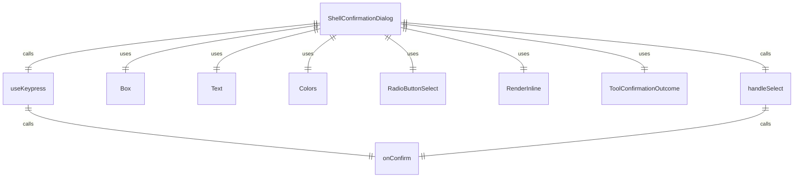
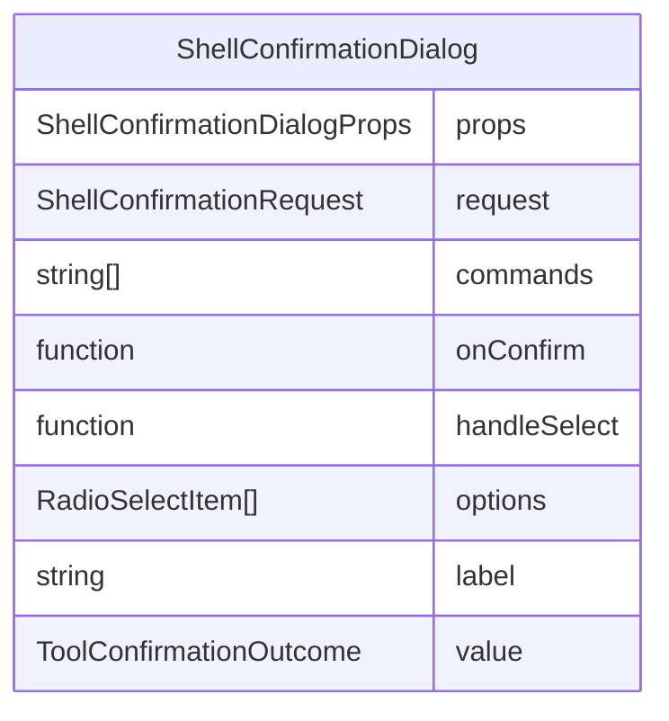

# ShellConfirmationDialog.tsx

Shell命令确认对话框组件，用于在执行Shell命令前向用户请求确认。

## 功能概述

1. 显示待执行的Shell命令列表
2. 提供多种确认选项（允许一次、总是允许、取消）
3. 处理用户选择并回调父组件
4. 支持ESC键取消操作

## 组件结构

### ShellConfirmationDialog
- 接收Shell命令确认请求作为属性
- 使用 RadioButtonSelect 组件显示选择选项
- 显示待执行的命令列表
- 处理用户选择并调用回调函数

## 接口定义

### ShellConfirmationRequest
- `commands`: 待执行的命令数组
- `onConfirm`: 用户确认后的回调函数

### ShellConfirmationDialogProps
- `request`: Shell命令确认请求对象

## 确认选项

1. **允许一次**：
   - 标签：'Yes, allow once'
   - 值：ToolConfirmationOutcome.ProceedOnce

2. **总是允许（本次会话）**：
   - 标签：'Yes, allow always for this session'
   - 值：ToolConfirmationOutcome.ProceedAlways

3. **取消**：
   - 标签：'No (esc)'
   - 值：ToolConfirmationOutcome.Cancel

## 事件处理

### 键盘事件
- 使用 `useKeypress` hook 监听键盘事件
- ESC键触发取消操作

### 选择事件
- 使用 `handleSelect` 函数处理 RadioButtonSelect 的选择事件
- 根据选择结果调用 `onConfirm` 回调函数
- 对于允许选项，传递批准的命令列表

## 依赖关系

- 依赖 `react` 和 `ink` 组件
- 依赖 `@google/gemini-cli-core` 的 `ToolConfirmationOutcome` 枚举
- 依赖 `../colors.js` 的颜色定义
- 依赖 `../utils/InlineMarkdownRenderer.js` 的内联Markdown渲染器
- 依赖 `./shared/RadioButtonSelect.js` 的单选按钮组件
- 依赖 `../hooks/useKeypress.js` 的键盘事件 hook

## 函数级调用关系

## 变量级调用关系

