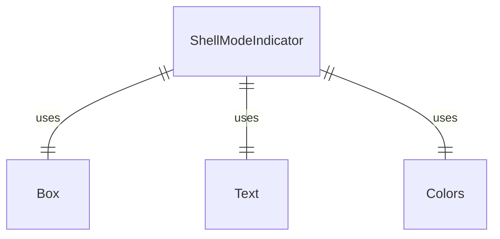
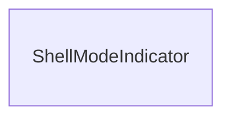

# ShellModeIndicator.tsx

Shell模式指示器组件，用于在启用Shell模式时显示提示信息。

## 功能概述

1. 显示Shell模式已启用的提示信息
2. 提供退出Shell模式的说明

## 组件结构

### ShellModeIndicator
- 简单的函数式组件
- 使用Text组件显示提示信息
- 使用不同颜色区分主要信息和辅助信息

## 显示内容

- 主要信息："shell mode enabled"（黄色显示）
- 辅助信息：" (esc to disable)"（灰色显示）

## 依赖关系

- 依赖 `react` 和 `ink` 的 `Box`、`Text` 组件
- 依赖 `../colors.js` 的颜色定义

## 函数级调用关系

## 变量级调用关系

