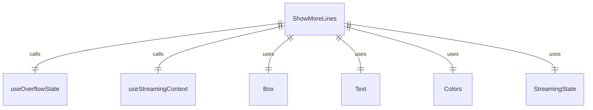
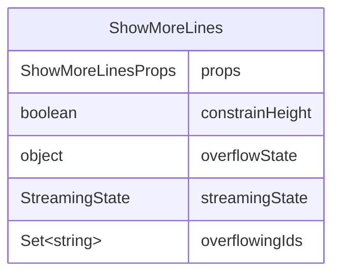

# ShowMoreLines.tsx

显示更多行提示组件，用于在内容溢出时提示用户按快捷键显示更多内容。

## 功能概述

1. 在内容溢出时显示提示信息
2. 仅在特定条件下显示（高度受限且流处于空闲或等待确认状态）
3. 提示用户按Ctrl+S显示更多行

## 组件结构

### ShowMoreLines
- 接收是否限制高度的属性
- 使用React hooks获取溢出状态和流状态
- 条件渲染提示信息

## 接口定义

### ShowMoreLinesProps
- `constrainHeight`: 是否限制高度的布尔值

## 条件渲染逻辑

组件在以下情况下不渲染（返回null）：
1. 溢出状态未定义
2. 没有溢出的内容ID
3. 未限制高度
4. 流状态不是空闲或等待确认状态

## 依赖关系

- 依赖 `ink` 的 `Box`、`Text` 组件
- 依赖 `../contexts/OverflowContext.js` 的溢出状态上下文
- 依赖 `../contexts/StreamingContext.js` 的流状态上下文
- 依赖 `../types.js` 的 `StreamingState` 枚举
- 依赖 `../colors.js` 的颜色定义

## 函数级调用关系

## 变量级调用关系

