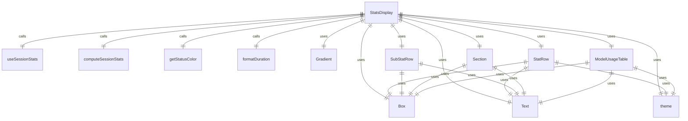
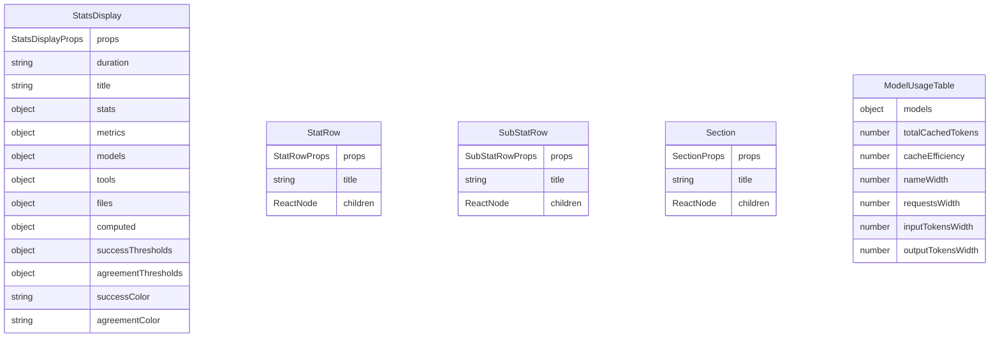

# StatsDisplay.tsx

统计信息显示组件，用于展示会话期间的各种统计信息，包括工具调用、性能指标和模型使用情况。

## 功能概述

1. 显示会话统计信息摘要
2. 展示工具调用成功率和用户同意率
3. 显示性能指标（运行时间、API时间、工具时间等）
4. 展示模型使用情况和缓存效率
5. 支持自定义标题和渐变效果

## 组件结构

### StatsDisplay
- 主要统计信息显示组件
- 使用 React hooks 获取会话统计信息
- 计算各种统计指标
- 使用子组件渲染不同部分的统计信息

### 子组件
1. **StatRow**: 用于渲染统计信息行
2. **SubStatRow**: 用于渲染缩进的次要统计信息行
3. **Section**: 用于分组相关的统计信息
4. **ModelUsageTable**: 用于显示模型使用情况表格

## 接口定义

### StatsDisplayProps
- `duration`: 会话持续时间字符串
- `title`: 可选的自定义标题

### StatRowProps
- `title`: 统计项标题
- `children`: 统计值内容（支持复杂的内容和颜色）

### SubStatRowProps
- `title`: 统计项标题
- `children`: 统计值内容

### SectionProps
- `title`: 部分标题
- `children`: 子内容

## 统计信息分类

### 交互摘要 (Interaction Summary)
- 会话ID
- 工具调用总数、成功数、失败数
- 工具调用成功率
- 用户同意率（如果有决策）
- 代码变更行数（添加/删除）

### 性能指标 (Performance)
- 总运行时间
- Agent活跃时间
- API调用时间及占比
- 工具执行时间及占比

### 模型使用情况 (Model Usage)
- 各模型的请求数量
- 输入令牌数
- 输出令牌数
- 缓存效率和节省的令牌数

## 状态管理

- 使用 `useSessionStats` 获取会话统计信息
- 使用 `computeSessionStats` 计算派生统计指标
- 使用 `getStatusColor` 根据阈值确定显示颜色

## 颜色和主题

- 使用 `theme` 对象获取颜色和主题设置
- 支持渐变标题效果
- 根据成功率和同意率使用不同颜色显示

## 依赖关系

- 依赖 `react` 和 `ink` 组件
- 依赖 `ink-gradient` 的渐变文本组件
- 依赖 `../semantic-colors.js` 的主题定义
- 依赖 `../utils/formatters.js` 的时间格式化函数
- 依赖 `../contexts/SessionContext.js` 的会话统计上下文
- 依赖 `../utils/displayUtils.js` 的显示工具函数
- 依赖 `../utils/computeStats.js` 的统计计算函数

## 函数级调用关系

## 变量级调用关系

