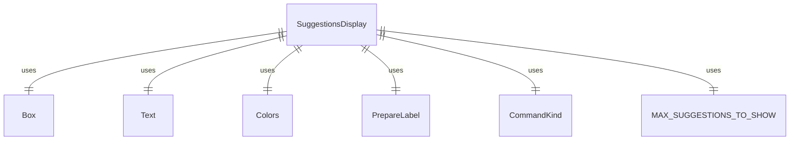
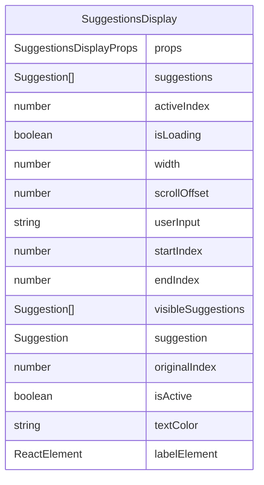

# SuggestionsDisplay.tsx

建议显示组件，用于在用户输入时显示自动完成建议列表。

## 功能概述

1. 显示自动完成建议列表
2. 支持键盘导航和高亮显示活动项
3. 支持滚动显示大量建议
4. 显示加载状态
5. 支持命令和描述的高亮显示

## 组件结构

### SuggestionsDisplay
- 接收建议列表、活动索引、加载状态等属性
- 根据加载状态显示加载提示
- 计算可见建议项的范围
- 渲染可见建议项列表
- 显示滚动指示器

## 接口定义

### Suggestion
- `label`: 建议项标签
- `value`: 建议项值
- `description`: 可选的描述信息
- `matchedIndex`: 匹配索引（用于高亮）
- `commandKind`: 命令类型

### SuggestionsDisplayProps
- `suggestions`: 建议项数组
- `activeIndex`: 活动项索引
- `isLoading`: 是否正在加载
- `width`: 显示宽度
- `scrollOffset`: 滚动偏移量
- `userInput`: 用户输入文本

## 显示逻辑

### 加载状态
- 当 `isLoading` 为 true 时显示 "Loading suggestions..."

### 空建议列表
- 当建议列表为空时返回 null，不渲染任何内容

### 可见建议计算
- 根据 `scrollOffset` 和 `MAX_SUGGESTIONS_TO_SHOW` 计算可见建议范围
- 使用 `slice` 方法获取可见建议项

### 建议项渲染
- 使用 `PrepareLabel` 组件渲染高亮标签
- 根据是否为活动项设置不同颜色
- 显示命令类型标记（如 [MCP]）
- 显示描述信息（如果存在）

### 滚动指示器
- 当有更多建议项隐藏在上方时显示 "▲"
- 当有更多建议项隐藏在下方时显示 "▼"
- 显示当前选中项位置信息（如 (1/10)）

## 常量

### MAX_SUGGESTIONS_TO_SHOW
- 最大显示建议项数量（8个）

## 依赖关系

- 依赖 `ink` 的 `Box`、`Text` 组件
- 依赖 `../colors.js` 的颜色定义
- 依赖 `./PrepareLabel.js` 的标签准备组件
- 依赖 `../commands/types.js` 的 `CommandKind` 枚举

## 函数级调用关系

## 变量级调用关系

