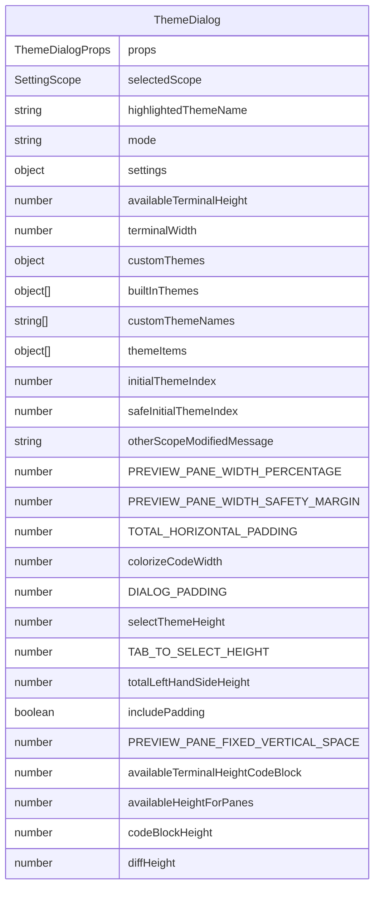

# ThemeDialog.tsx

主题选择对话框组件，用于显示和选择应用程序的主题。

## 功能概述

1. 显示可用的主题列表（内置主题和自定义主题）
2. 提供主题预览功能（代码和差异显示）
3. 支持用户和工作区两种作用域
4. 实现键盘导航和选择
5. 动态调整布局以适应终端尺寸

## 组件结构

### ThemeDialog
- 使用 React hooks 管理状态和键盘事件
- 计算布局尺寸以适应终端大小
- 渲染主题选择器和预览面板
- 处理主题选择和作用域切换

## 接口定义

### ThemeDialogProps
- `onSelect`: 主题选择后的回调函数
- `onHighlight`: 主题高亮时的回调函数
- `settings`: 设置对象
- `availableTerminalHeight`: 可用终端高度（可选）
- `terminalWidth`: 终端宽度

## 状态管理

### 主要状态变量
- `selectedScope`: 选定的作用域（用户或工作区）
- `highlightedThemeName`: 当前高亮的主题名称
- `mode`: 当前模式（'theme' 或 'scope'）

## 主题列表生成

### 内置主题
- 从 `themeManager` 获取可用的内置主题
- 过滤掉自定义类型的主题

### 自定义主题
- 根据选定作用域获取用户或合并的自定义主题
- 标记为 "Custom" 类型

### 主题项结构
- `label`: 显示标签
- `value`: 主题值
- `themeNameDisplay`: 主题名称显示
- `themeTypeDisplay`: 主题类型显示

## 布局计算

### 预览面板布局
- 预览面板宽度占总宽度的55%
- 安全边距防止文本触碰边框
- 考虑对话框和预览面板的水平内边距

### 高度自适应
- 根据可用终端高度动态调整内容显示
- 计算代码块和差异显示的高度分配
- 代码块占60%，差异显示占40%

## 键盘交互

### 模式切换
- Tab键：在主题选择和作用域配置之间切换

### 选择操作
- Enter键：根据当前模式选择主题或应用作用域

### 退出操作
- Escape键：关闭对话框

## 预览功能

### 代码预览
- 使用 `colorizeCode` 显示带语法高亮的Python代码示例

### 差异预览
- 使用 `DiffRenderer` 显示差异渲染效果
- 展示主题在差异显示中的效果

## 作用域管理

### 作用域选择器
- 使用 `ScopeSelector` 组件显示作用域选项
- 支持用户和工作区两种作用域

### 作用域消息
- 使用 `getScopeMessageForSetting` 获取其他作用域的修改消息

## 依赖关系

- 依赖 `react` 和 `ink` 组件
- 依赖 `../colors.js` 的颜色定义
- 依赖 `../themes/theme-manager.js` 的主题管理器
- 依赖 `./shared/RadioButtonSelect.js` 的单选按钮组件
- 依赖 `./messages/DiffRenderer.js` 的差异渲染器
- 依赖 `../utils/CodeColorizer.js` 的代码着色器
- 依赖 `../../config/settings.js` 的设置类型和作用域
- 依赖 `../../utils/dialogScopeUtils.js` 的作用域工具函数
- 依赖 `../hooks/useKeypress.js` 的键盘事件 hook
- 依赖 `./shared/ScopeSelector.js` 的作用域选择器组件

## 函数级调用关系

```mermaid
erDiagram
    ThemeDialog ||--|| useState : calls
    ThemeDialog ||--|| useCallback : calls
    ThemeDialog ||--|| useKeypress : calls
    ThemeDialog ||--|| Box : uses
    ThemeDialog ||--|| Text : uses
    ThemeDialog ||--|| Colors : uses
    ThemeDialog ||--|| themeManager : uses
    ThemeDialog ||--|| RadioButtonSelect : uses
    ThemeDialog ||--|| DiffRenderer : uses
    ThemeDialog ||--|| colorizeCode : calls
    ThemeDialog ||--|| getScopeMessageForSetting : calls
    ThemeDialog ||--|| ScopeSelector : uses
    ThemeDialog ||--|| SettingScope : uses
    ThemeDialog ||--|| handleThemeSelect : calls
    ThemeDialog ||--|| handleThemeHighlight : calls
    ThemeDialog ||--|| handleScopeHighlight : calls
    ThemeDialog ||--|| handleScopeSelect : calls
```

## 变量级调用关系

