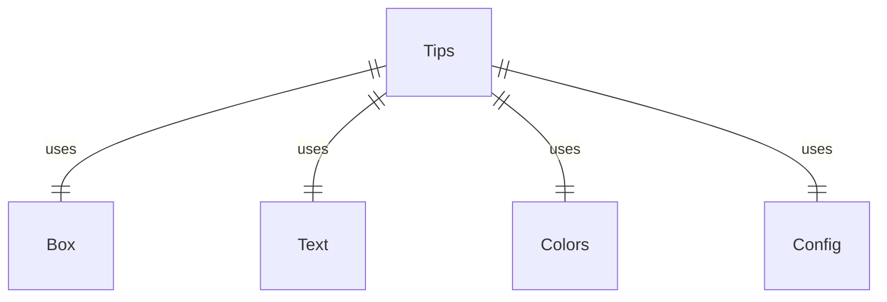
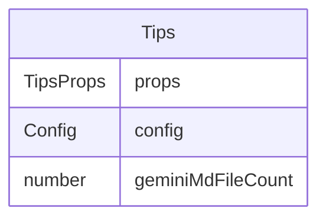

# Tips.tsx

提示信息组件，用于向用户显示入门提示和使用建议。

## 功能概述

1. 显示入门使用提示
2. 根据是否存在GEMINI.md文件动态调整提示内容
3. 提供关键功能的使用建议

## 组件结构

### Tips
- 接收配置对象作为属性
- 获取GEMINI.md文件数量
- 条件渲染提示信息
- 使用不同颜色和样式突出重要信息

## 接口定义

### TipsProps
- `config`: 配置对象

## 提示内容

### 基本提示
1. 询问问题、编辑文件或运行命令
2. 提供具体信息以获得最佳结果
3. 使用/help命令获取更多信息

### 条件提示
- 当不存在GEMINI.md文件时，提示用户创建该文件来自定义与Gemini的交互

## 依赖关系

- 依赖 `react` 和 `ink` 的 `Box`、`Text` 组件
- 依赖 `../colors.js` 的颜色定义
- 依赖 `@google/gemini-cli-core` 的 `Config` 类型

## 函数级调用关系

## 变量级调用关系

