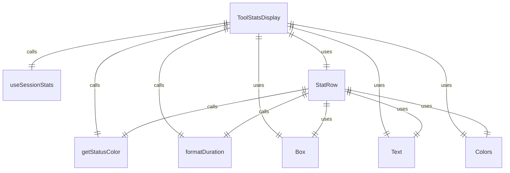
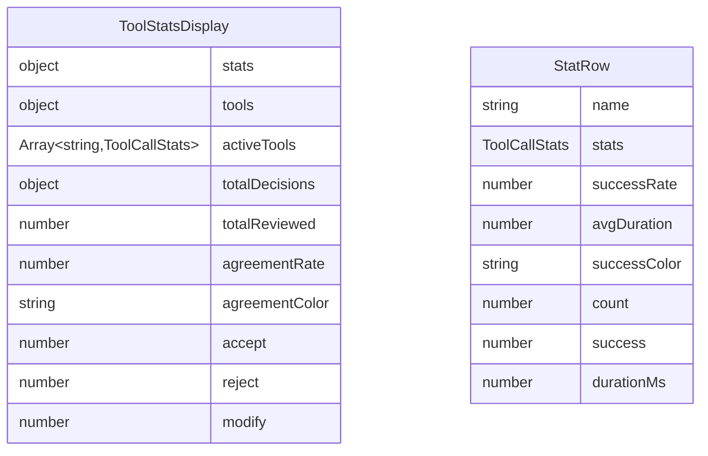

# ToolStatsDisplay.tsx

工具统计信息显示组件，用于展示会话期间各种工具的调用统计信息。

## 功能概述

1. 显示各工具的调用次数、成功率和平均执行时间
2. 展示用户对工具建议的决策统计
3. 根据成功率和用户同意率使用不同颜色显示
4. 在没有工具调用时显示提示信息

## 组件结构

### ToolStatsDisplay
- 主要工具统计信息显示组件
- 使用 React hooks 获取会话统计信息
- 过滤出有调用记录的活跃工具
- 计算用户决策统计和整体同意率

### StatRow
- 子组件，用于渲染单个工具的统计信息行
- 计算工具的成功率和平均执行时间
- 根据成功率使用不同颜色显示

## 状态管理

- 使用 `useSessionStats` 获取会话统计信息
- 从统计信息中提取工具指标
- 过滤出有调用记录的活跃工具

## 统计信息

### 工具调用统计
- 工具名称
- 调用次数
- 成功率（带颜色标识）
- 平均执行时间

### 用户决策统计
- 总审查建议数
- 接受数（绿色显示）
- 拒绝数（红色显示）
- 修改数（黄色显示）
- 整体同意率（带颜色标识）

## 条件渲染

- 当没有活跃工具时显示提示信息："No tool calls have been made in this session."

## 颜色标识

### 成功率颜色
- 高成功率（≥95%）：绿色
- 中等成功率（≥80%）：黄色
- 低成功率（<80%）：红色

### 用户同意率颜色
- 高同意率（≥90%）：绿色
- 中等同意率（≥70%）：黄色
- 低同意率（<70%）：红色

## 布局常量

- `TOOL_NAME_COL_WIDTH`: 工具名称列宽度（25）
- `CALLS_COL_WIDTH`: 调用次数列宽度（8）
- `SUCCESS_RATE_COL_WIDTH`: 成功率列宽度（15）
- `AVG_DURATION_COL_WIDTH`: 平均时间列宽度（15）

## 依赖关系

- 依赖 `react` 和 `ink` 组件
- 依赖 `../colors.js` 的颜色定义
- 依赖 `../utils/formatters.js` 的时间格式化函数
- 依赖 `../utils/displayUtils.js` 的显示工具函数
- 依赖 `../contexts/SessionContext.js` 的会话统计上下文
- 依赖 `@google/gemini-cli-core` 的 `ToolCallStats` 类型

## 函数级调用关系

## 变量级调用关系

