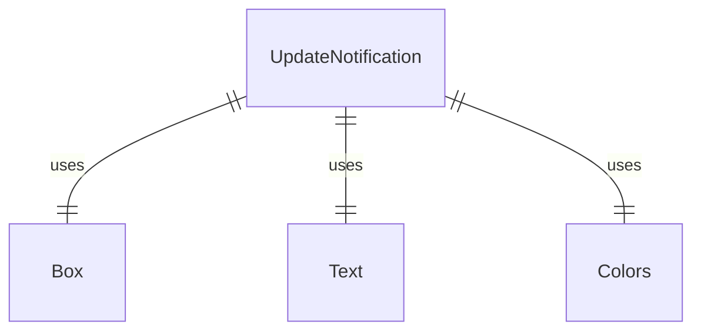
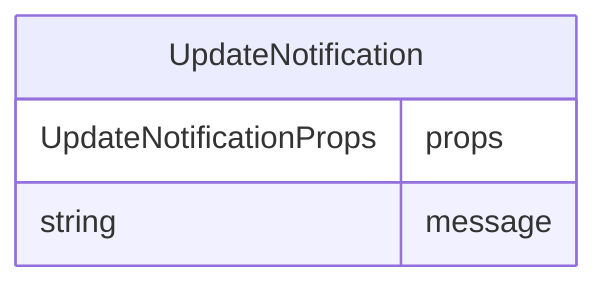

# UpdateNotification.tsx

更新通知组件，用于显示应用程序更新相关信息。

## 功能概述

1. 显示更新通知消息
2. 使用黄色边框和文本突出显示重要信息
3. 提供一致的更新通知UI样式

## 组件结构

### UpdateNotification
- 接收通知消息作为属性
- 使用Box组件创建带边框的容器
- 使用Text组件显示消息内容
- 应用统一的颜色主题

## 接口定义

### UpdateNotificationProps
- `message`: 通知消息字符串

## 样式设计

- 边框样式：圆角边框
- 边框颜色：黄色（Colors.AccentYellow）
- 文本颜色：黄色（Colors.AccentYellow）
- 水平内边距：1
- 垂直外边距：1

## 依赖关系

- 依赖 `ink` 的 `Box`、`Text` 组件
- 依赖 `../colors.js` 的颜色定义

## 函数级调用关系

## 变量级调用关系

