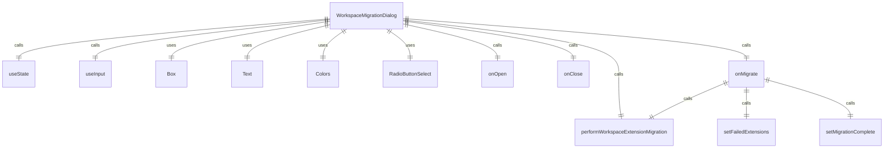
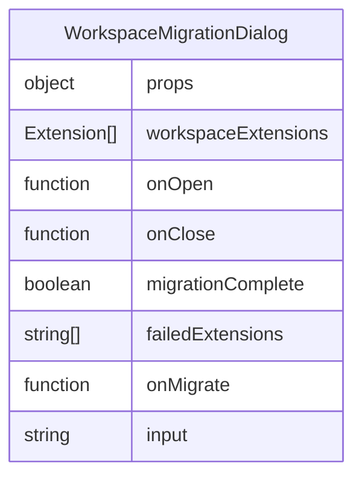

# WorkspaceMigrationDialog.tsx

工作区迁移对话框组件，用于处理工作区级别扩展的迁移操作。

## 功能概述

1. 显示工作区扩展迁移提示
2. 提供迁移或跳过选项
3. 执行扩展迁移操作
4. 显示迁移结果和失败信息
5. 支持退出应用程序

## 组件结构

### WorkspaceMigrationDialog
- 接收工作区扩展列表和回调函数作为属性
- 使用 React hooks 管理迁移状态
- 根据迁移状态显示不同内容
- 处理用户输入和选择

## 接口定义

### Props
- `workspaceExtensions`: 工作区扩展数组
- `onOpen`: 对话框打开时的回调函数
- `onClose`: 对话框关闭时的回调函数

## 状态管理

### 主要状态变量
- `migrationComplete`: 迁移是否完成的布尔值
- `failedExtensions`: 迁移失败的扩展名称数组

## 迁移流程

### 初始状态
- 显示工作区扩展已弃用的提示信息
- 列出需要迁移的扩展
- 提供"安装所有"和"跳过"选项

### 迁移操作
- 调用 `performWorkspaceExtensionMigration` 执行迁移
- 更新迁移完成状态
- 记录迁移失败的扩展

### 迁移完成状态
- 显示迁移完成消息
- 列出迁移失败的扩展（如果有）
- 提示用户重启应用程序
- 按 'q' 键退出应用程序

## 键盘交互

- 迁移完成后，按 'q' 键退出应用程序

## 选项

### 迁移选项
1. **安装所有**：
   - 标签：'Install all'
   - 值：'migrate'
   - 执行迁移操作

2. **跳过**：
   - 标签：'Skip'
   - 值：'skip'
   - 关闭对话框

## 依赖关系

- 依赖 `react` 和 `ink` 组件
- 依赖 `../../config/extension.js` 的扩展类型和迁移函数
- 依赖 `./shared/RadioButtonSelect.js` 的单选按钮组件
- 依赖 `../colors.js` 的颜色定义

## 函数级调用关系

## 变量级调用关系

