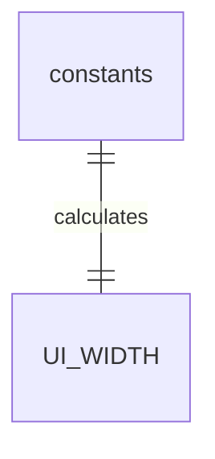
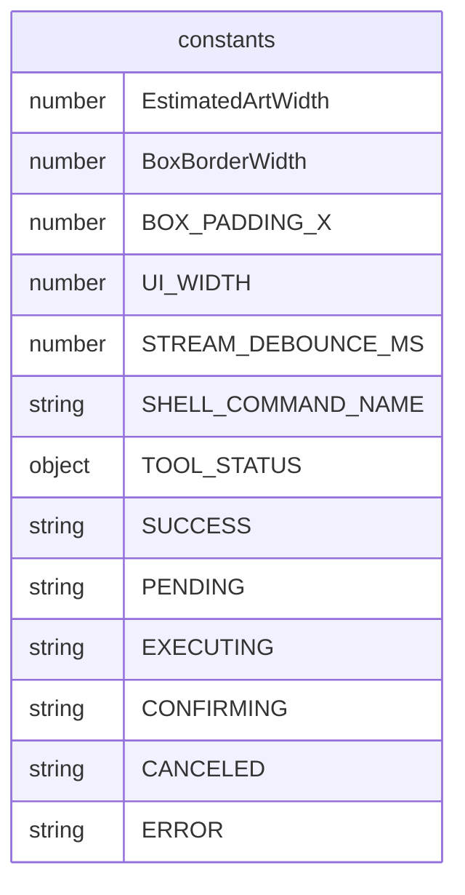

# constants.ts

这个文件定义了应用程序 UI 中使用的各种常量。

## 功能概述

1. 定义 UI 布局相关的常量
2. 定义流处理相关的常量
3. 定义工具命令相关的常量
4. 定义工具状态符号常量

## 常量定义

### UI 布局常量
- `EstimatedArtWidth`：估计的艺术字宽度（59）
- `BoxBorderWidth`：盒子边框宽度（1）
- `BOX_PADDING_X`：盒子水平内边距（1）
- `UI_WIDTH`：UI 宽度，基于艺术字、内边距和边框计算（约 63）

### 流处理常量
- `STREAM_DEBOUNCE_MS`：流处理的防抖毫秒数（100）

### 工具命令常量
- `SHELL_COMMAND_NAME`：Shell 命令名称（"Shell Command"）

### 工具状态符号
- `TOOL_STATUS`：工具状态符号对象
  - `SUCCESS`：成功（'✓'）
  - `PENDING`：待处理（'o'）
  - `EXECUTING`：执行中（'⊷'）
  - `CONFIRMING`：确认中（'?'）
  - `CANCELED`：已取消（'-'）
  - `ERROR`：错误（'x'）

## 函数级调用关系

## 变量级调用关系

