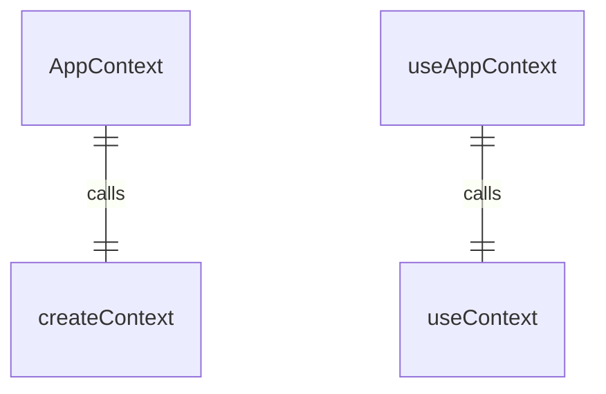
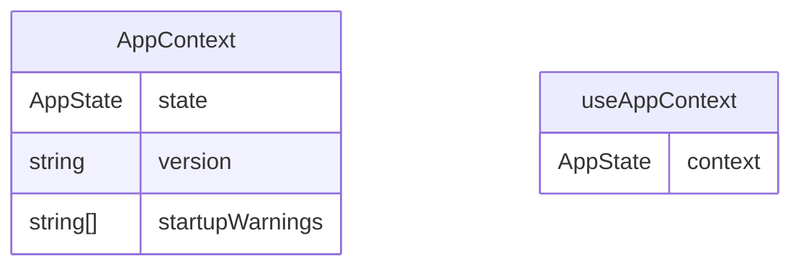

# AppContext.tsx

应用程序上下文，用于提供全局应用程序状态。

## 功能概述

1. 提供应用程序版本信息
2. 提供启动警告信息
3. 实现React Context模式

## 接口定义

### AppState
- `version`: 应用程序版本字符串
- `startupWarnings`: 启动警告信息数组

## 导出内容

### AppContext
- React Context对象
- 类型为`AppState | null`
- 初始值为null

### useAppContext
- 自定义hook，用于访问应用程序上下文
- 包含错误检查，确保在AppProvider内使用
- 返回AppState对象

## 使用方式

1. 使用AppProvider包装应用程序根组件
2. 在子组件中使用useAppContext hook访问状态

## 依赖关系

- 依赖 `react` 的 `createContext` 和 `useContext`

## 函数级调用关系

## 变量级调用关系

