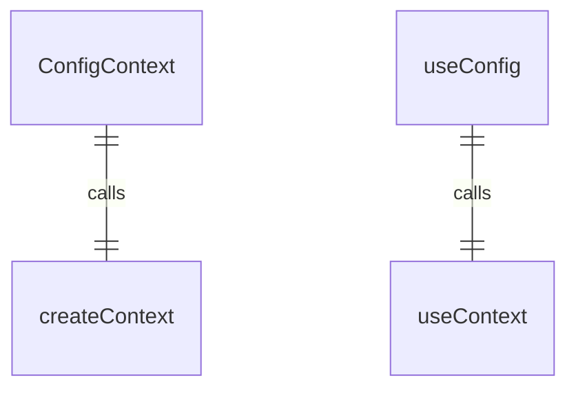
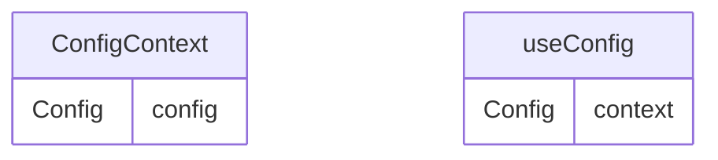

# ConfigContext.tsx

配置上下文，用于提供应用程序配置信息。

## 功能概述

1. 提供应用程序配置对象
2. 实现React Context模式
3. 提供类型安全的配置访问

## 导出内容

### ConfigContext
- React Context对象
- 类型为`Config | undefined`
- 初始值为undefined

### useConfig
- 自定义hook，用于访问配置上下文
- 包含错误检查，确保在ConfigProvider内使用
- 返回Config对象

## 使用方式

1. 使用ConfigProvider包装需要访问配置的组件
2. 在子组件中使用useConfig hook访问配置对象

## 依赖关系

- 依赖 `react` 的 `createContext` 和 `useContext`
- 依赖 `@google/gemini-cli-core` 的 `Config` 类型

## 函数级调用关系

## 变量级调用关系

