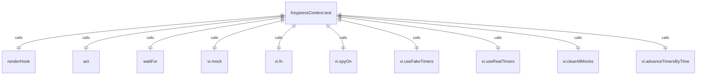
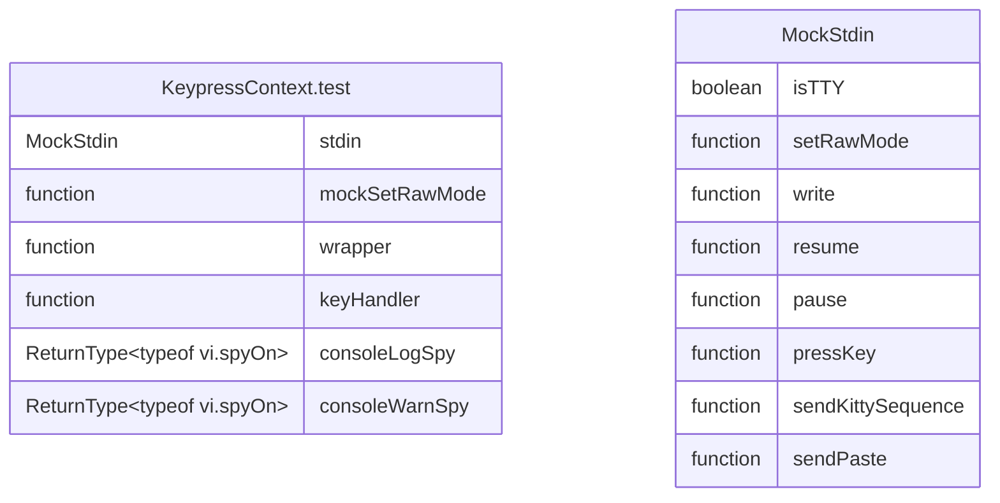

# KeypressContext.test.tsx

KeypressContext的测试文件，用于验证键盘事件处理和Kitty协议支持。

## 功能概述

1. 测试Kitty协议的键盘事件解析
2. 验证特殊按键处理（Enter、Escape、Tab、Backspace等）
3. 测试粘贴模式处理
4. 验证拖拽操作处理
5. 测试调试日志功能

## 测试套件结构

### Kitty协议测试
- Enter键处理测试
  - 普通Enter键识别
  - 数字键盘Enter键识别
  - 带修饰键的Enter键处理
  - 禁用Kitty协议时的行为
- Escape键处理测试
- Tab和Backspace键处理测试
- 参数化功能键测试
- Shift+Tab形式测试
- 双击和批处理测试

### 粘贴模式测试
- 多行粘贴作为单个事件处理

### 拖拽处理测试
- 拖拽开始检测
- 拖拽数据收集
- 拖拽完成超时处理

### 调试日志测试
- 按键记录功能
- Kitty缓冲区累积日志
- Kitty缓冲区溢出日志
- Ctrl+C清除缓冲区日志

## 依赖关系

- 依赖 `@testing-library/react` 的 `renderHook`、`act`、`waitFor`
- 依赖 `vitest` 的 `vi` 和 `Mock`
- 依赖 `./KeypressContext.js` 的类型和常量
- 依赖 `ink` 的 `useStdin`
- 依赖 `node:events` 的 `EventEmitter`

## 函数级调用关系

## 变量级调用关系

