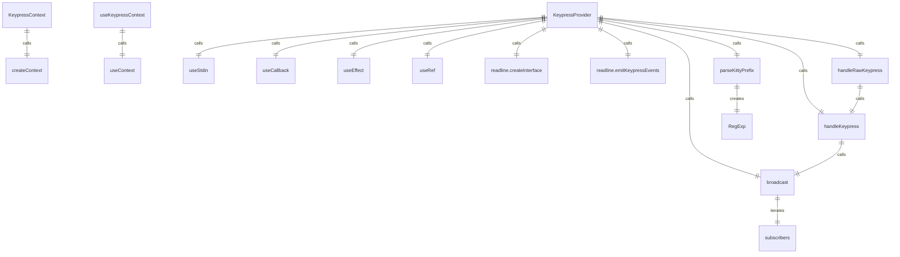

# KeypressContext.tsx

键盘按键上下文，用于处理和分发键盘事件。

## 功能概述

1. 提供键盘事件处理和分发机制
2. 支持Kitty协议的高级键盘事件处理
3. 处理粘贴模式和拖拽操作
4. 实现React Context模式

## 接口定义

### Key
- `name`: 按键名称
- `ctrl`: 是否按下Ctrl键
- `meta`: 是否按下Meta键
- `shift`: 是否按下Shift键
- `paste`: 是否为粘贴事件
- `sequence`: 按键序列
- `kittyProtocol`: 是否使用Kitty协议（可选）

### KeypressContextValue
- `subscribe`: 订阅键盘事件处理函数
- `unsubscribe`: 取消订阅键盘事件处理函数

## 导出内容

### KeypressContext
- React Context对象
- 类型为`KeypressContextValue | undefined`
- 初始值为undefined

### useKeypressContext
- 自定义hook，用于访问键盘事件上下文
- 包含错误检查，确保在KeypressProvider内使用
- 返回KeypressContextValue对象

### KeypressProvider
- Context Provider组件
- 处理原始键盘输入
- 支持Kitty协议和传统键盘事件
- 管理订阅者列表

## 核心功能

### Kitty协议支持
- 解析Kitty协议的键盘事件序列
- 支持带修饰键的功能键
- 处理反向Tab、箭头键、功能键等

### 粘贴模式处理
- 检测粘贴开始和结束标记
- 缓冲粘贴数据
- 广播粘贴事件

### 拖拽操作处理
- 检测拖拽操作
- 缓冲拖拽数据
- 定时广播拖拽完成事件

### 特殊按键处理
- 处理反斜杠+回车的特殊组合
- 处理Ctrl+C中断信号
- 处理引号字符输入

## 常量定义

- `PASTE_MODE_PREFIX`: 粘贴模式前缀
- `PASTE_MODE_SUFFIX`: 粘贴模式后缀
- `DRAG_COMPLETION_TIMEOUT_MS`: 拖拽完成超时时间
- 各种Kitty协议相关的常量

## 使用方式

1. 使用KeypressProvider包装应用程序根组件
2. 在子组件中使用useKeypressContext hook访问键盘事件处理功能
3. 通过subscribe/unsubscribe方法注册/注销键盘事件处理函数

## 依赖关系

- 依赖 `react` 的 `createContext`、`useContext`、`useCallback`、`useEffect`、`useRef`
- 依赖 `ink` 的 `useStdin`
- 依赖 `node:readline` 的 readline接口
- 依赖 `node:stream` 的 PassThrough流
- 依赖 `@google/gemini-cli-core` 的相关类型和函数
- 依赖 `../utils/platformConstants.js` 的平台常量
- 依赖 `../hooks/useFocus.js` 的焦点事件

## 函数级调用关系



## 变量级调用关系

```mermaid
erDiagram
    KeypressContext {
        KeypressContextValue value
    }
    useKeypressContext {
        KeypressContextValue context
    }
    KeypressProvider {
        object props
        boolean kittyProtocolEnabled
        Config config
        boolean debugKeystrokeLogging
        object stdin
        function setRawMode
        Set~KeypressHandler~ subscribers
        boolean isDraggingRef
        string dragBufferRef
        NodeJS.Timeout draggingTimerRef
        boolean isPaste
        Buffer pasteBuffer
        string kittySequenceBuffer
        NodeJS.Timeout backslashTimeout
        boolean waitingForEnterAfterBackslash
        function subscribe
        function unsubscribe
        boolean usePassthrough
        readline.Interface rl
        PassThrough keypressStream
    }
    parseKittyPrefix {
        string buffer
        object m
        number mods
        number bits
        boolean shift
        boolean alt
        boolean ctrl
        string sym
        string name
        number keyCode
        number modifiers
        number modifierBits
        string terminator
    }
    handleKeypress {
        unknown _
        Key key
        boolean isPaste
        Buffer pasteBuffer
        boolean waitingForEnterAfterBackslash
        NodeJS.Timeout backslashTimeout
        string kittySequenceBuffer
        boolean parsedAny
    }
    handleRawKeypress {
        Buffer data
        Buffer pasteModePrefixBuffer
        Buffer pasteModeSuffixBuffer
        number pos
        number prefixPos
        number suffixPos
        boolean isPrefixNext
        boolean isSuffixNext
        number nextMarkerPos
        number markerLength
    }
```