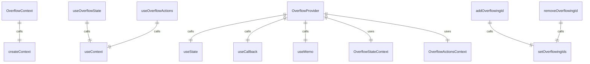
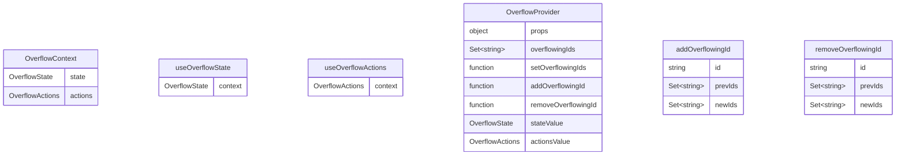

# OverflowContext.tsx

溢出上下文，用于管理界面元素的溢出状态。

## 功能概述

1. 跟踪哪些界面元素处于溢出状态
2. 提供添加和移除溢出元素ID的方法
3. 实现React Context模式，分离状态和操作

## 接口定义

### OverflowState
- `overflowingIds`: 只读的溢出元素ID集合

### OverflowActions
- `addOverflowingId`: 添加溢出元素ID的函数
- `removeOverflowingId`: 移除溢出元素ID的函数

## 导出内容

### OverflowStateContext
- React Context对象，用于提供溢出状态
- 类型为`OverflowState | undefined`
- 初始值为undefined

### OverflowActionsContext
- React Context对象，用于提供溢出操作
- 类型为`OverflowActions | undefined`
- 初始值为undefined

### useOverflowState
- 自定义hook，用于访问溢出状态
- 返回OverflowState对象或undefined

### useOverflowActions
- 自定义hook，用于访问溢出操作
- 返回OverflowActions对象或undefined

### OverflowProvider
- Context Provider组件
- 管理溢出元素ID的状态
- 提供添加和移除溢出元素ID的方法

## 状态管理

### overflowingIds
- 使用`useState`管理溢出元素ID集合
- 使用`Set<string>`确保ID唯一性
- 通过回调函数更新状态以避免不必要的重渲染

### addOverflowingId
- 添加新的溢出元素ID到集合中
- 如果ID已存在则不进行任何操作
- 使用`useCallback`优化性能

### removeOverflowingId
- 从集合中移除溢出元素ID
- 如果ID不存在则不进行任何操作
- 使用`useCallback`优化性能

## 性能优化

### useMemo
- 使用`useMemo`缓存stateValue和actionsValue
- 避免在每次渲染时创建新对象
- 仅在依赖项变化时重新计算

## 使用方式

1. 使用OverflowProvider包装需要管理溢出状态的组件
2. 在子组件中使用useOverflowState hook访问溢出状态
3. 在子组件中使用useOverflowActions hook访问溢出操作方法

## 依赖关系

- 依赖 `react` 的 `createContext`、`useContext`、`useState`、`useCallback`、`useMemo`

## 函数级调用关系

## 变量级调用关系

