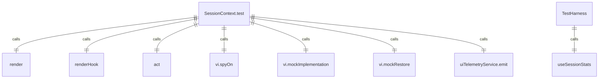
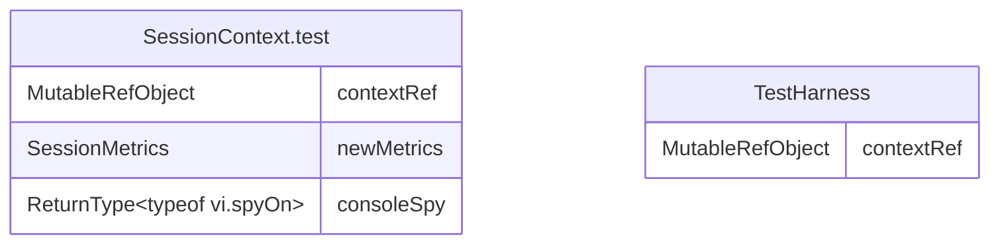

# SessionContext.test.tsx

SessionContext的测试文件，用于验证会话统计上下文的正确性和功能。

## 功能概述

1. 测试会话统计上下文的初始状态
2. 验证遥测服务更新时的指标更新
3. 测试在Provider外部使用hook时的错误处理

## 测试套件结构

### 初始状态测试
- 验证会话开始时间是否正确初始化
- 验证指标对象是否正确初始化
- 验证模型指标是否为空对象

### 遥测更新测试
- 模拟uiTelemetryService发出更新事件
- 验证上下文状态是否正确更新
- 验证指标数据是否正确反映
- 验证最后提示令牌数是否正确设置

### 错误处理测试
- 验证在SessionStatsProvider外部使用useSessionStats时是否抛出错误
- 验证错误消息是否正确

## 组件结构

### TestHarness
- 测试辅助组件，用于暴露上下文值
- 通过可变引用访问上下文函数和状态
- 允许直接与上下文交互并进行断言

## 依赖关系

- 依赖 `react` 的 `MutableRefObject`
- 依赖 `ink-testing-library` 的 `render`
- 依赖 `@testing-library/react` 的 `renderHook`
- 依赖 `react-dom/test-utils` 的 `act`
- 依赖 `./SessionContext.js` 的 `SessionMetrics`、`SessionStatsProvider` 和 `useSessionStats`
- 依赖 `vitest` 的 `describe`、`it`、`expect` 和 `vi`
- 依赖 `@google/gemini-cli-core` 的 `uiTelemetryService`

## 函数级调用关系

## 变量级调用关系

