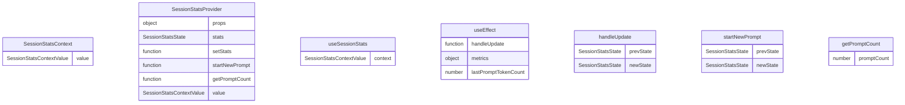

# SessionContext.tsx

会话统计上下文，用于管理应用程序会话期间的统计信息。

## 功能概述

1. 提供会话统计信息的全局访问
2. 跟踪会话指标和性能数据
3. 实现React Context模式

## 接口定义

### SessionStatsState
- `sessionId`: 会话ID
- `sessionStartTime`: 会话开始时间
- `metrics`: 会话指标数据
- `lastPromptTokenCount`: 最后一次提示的令牌数
- `promptCount`: 提示计数

### ComputedSessionStats
- `totalApiTime`: 总API时间
- `totalToolTime`: 总工具时间
- `agentActiveTime`: Agent活跃时间
- `apiTimePercent`: API时间占比
- `toolTimePercent`: 工具时间占比
- `cacheEfficiency`: 缓存效率
- `totalDecisions`: 总决策数
- `successRate`: 成功率
- `agreementRate`: 同意率
- `totalCachedTokens`: 总缓存令牌数
- `totalPromptTokens`: 总提示令牌数
- `totalLinesAdded`: 总添加行数
- `totalLinesRemoved`: 总删除行数

### SessionStatsContextValue
- `stats`: 会话统计状态
- `startNewPrompt`: 开始新提示的函数
- `getPromptCount`: 获取提示计数的函数

## 导出内容

### SessionStatsContext
- React Context对象
- 类型为`SessionStatsContextValue | undefined`
- 初始值为undefined

### SessionStatsProvider
- Context Provider组件
- 管理会话统计状态
- 监听遥测服务更新

### useSessionStats
- 自定义hook，用于访问会话统计信息
- 包含错误检查，确保在SessionStatsProvider内使用
- 返回SessionStatsContextValue对象

## 状态管理

### stats
- 使用`useState`管理会话统计状态
- 初始化包含会话ID、开始时间、指标数据等
- 通过遥测服务更新指标数据

### startNewPrompt
- 增加提示计数
- 使用`useCallback`优化性能

### getPromptCount
- 获取当前提示计数
- 使用`useCallback`优化性能

## 事件处理

### 遥测更新监听
- 使用`useEffect`监听遥测服务的更新事件
- 在组件挂载时注册事件监听器
- 在组件卸载时注销事件监听器
- 处理指标数据更新

## 性能优化

### useMemo
- 使用`useMemo`缓存context value
- 避免在每次渲染时创建新对象
- 仅在依赖项变化时重新计算

## 使用方式

1. 使用SessionStatsProvider包装应用程序根组件
2. 在子组件中使用useSessionStats hook访问会话统计信息

## 依赖关系

- 依赖 `react` 的 `createContext`、`useContext`、`useState`、`useCallback`、`useMemo`、`useEffect`
- 依赖 `@google/gemini-cli-core` 的 `SessionMetrics`、`ModelMetrics` 类型
- 依赖 `@google/gemini-cli-core` 的 `uiTelemetryService` 和 `sessionId`

## 函数级调用关系

## 变量级调用关系

