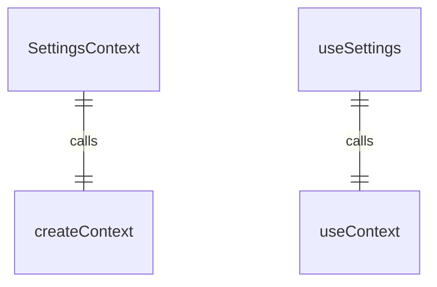
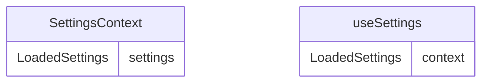

# SettingsContext.tsx

设置上下文，用于提供应用程序设置信息。

## 功能概述

1. 提供应用程序设置对象
2. 实现React Context模式
3. 提供类型安全的设置访问

## 导出内容

### SettingsContext
- React Context对象
- 类型为`LoadedSettings | undefined`
- 初始值为undefined

### useSettings
- 自定义hook，用于访问设置上下文
- 包含错误检查，确保在SettingsProvider内使用
- 返回LoadedSettings对象

## 使用方式

1. 使用SettingsProvider包装需要访问设置的组件
2. 在子组件中使用useSettings hook访问设置对象

## 依赖关系

- 依赖 `react` 的 `createContext` 和 `useContext`
- 依赖 `../../config/settings.js` 的 `LoadedSettings` 类型

## 函数级调用关系

## 变量级调用关系

