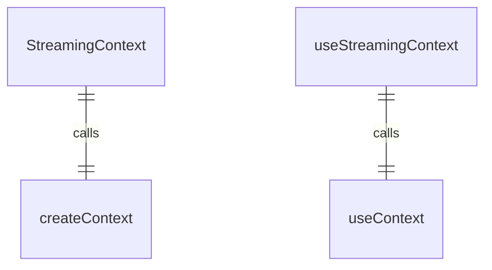
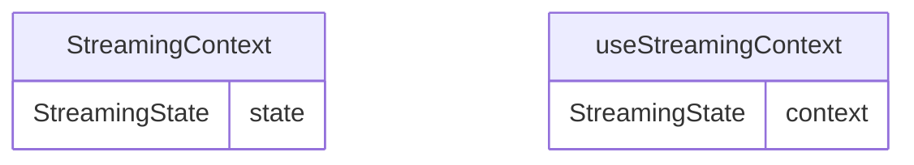

# StreamingContext.tsx

流状态上下文，用于提供应用程序流处理状态。

## 功能概述

1. 提供流处理状态信息
2. 实现React Context模式
3. 提供类型安全的流状态访问

## 导出内容

### StreamingContext
- React Context对象
- 类型为`StreamingState | undefined`
- 初始值为undefined

### useStreamingContext
- 自定义hook，用于访问流状态上下文
- 包含错误检查，确保在StreamingContextProvider内使用
- 返回StreamingState对象

## 使用方式

1. 使用StreamingContextProvider包装需要访问流状态的组件
2. 在子组件中使用useStreamingContext hook访问流状态

## 依赖关系

- 依赖 `react` 的 `createContext` 和 `useContext`
- 依赖 `../types.js` 的 `StreamingState` 类型

## 函数级调用关系

## 变量级调用关系

