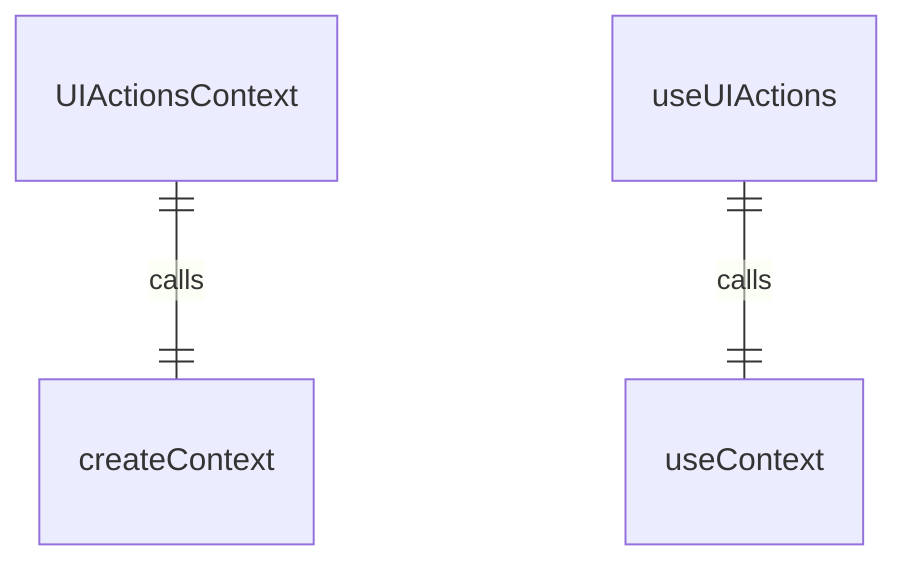
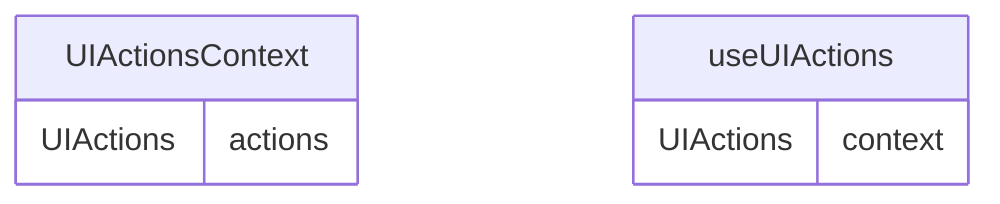

# UIActionsContext.tsx

UI操作上下文，用于提供应用程序UI操作的集中管理。

## 功能概述

1. 提供UI操作函数的全局访问
2. 实现React Context模式
3. 集中管理各种UI交互操作

## 接口定义

### UIActions
包含以下操作函数：

#### 主题相关
- `handleThemeSelect`: 处理主题选择
- `handleThemeHighlight`: 处理主题高亮

#### 认证相关
- `handleAuthSelect`: 处理认证类型选择
- `setAuthState`: 设置认证状态
- `onAuthError`: 处理认证错误

#### 编辑器相关
- `handleEditorSelect`: 处理编辑器选择
- `exitEditorDialog`: 退出编辑器对话框

#### 界面控制
- `exitPrivacyNotice`: 退出隐私声明
- `closeSettingsDialog`: 关闭设置对话框
- `setShellModeActive`: 设置Shell模式激活状态
- `setConstrainHeight`: 设置高度约束
- `onEscapePromptChange`: 处理退出提示变化
- `refreshStatic`: 刷新静态内容
- `handleClearScreen`: 处理清屏操作

#### 输入处理
- `vimHandleInput`: 处理Vim输入
- `handleFinalSubmit`: 处理最终提交

#### 对话框处理
- `handleIdePromptComplete`: 处理IDE提示完成
- `handleFolderTrustSelect`: 处理文件夹信任选择
- `onWorkspaceMigrationDialogOpen`: 工作区迁移对话框打开
- `onWorkspaceMigrationDialogClose`: 工作区迁移对话框关闭
- `handleProQuotaChoice`: 处理专业配额选择

## 导出内容

### UIActionsContext
- React Context对象
- 类型为`UIActions | null`
- 初始值为null

### useUIActions
- 自定义hook，用于访问UI操作函数
- 包含错误检查，确保在UIActionsProvider内使用
- 返回UIActions对象

## 使用方式

1. 使用UIActionsProvider包装应用程序根组件
2. 在子组件中使用useUIActions hook访问UI操作函数

## 依赖关系

- 依赖 `react` 的 `createContext` 和 `useContext`
- 依赖 `../hooks/useKeypress.js` 的 `Key` 类型
- 依赖 `../IdeIntegrationNudge.js` 的 `IdeIntegrationNudgeResult` 类型
- 依赖 `../components/FolderTrustDialog.js` 的 `FolderTrustChoice` 类型
- 依赖 `@google/gemini-cli-core` 的 `AuthType` 和 `EditorType` 类型
- 依赖 `../../config/settings.js` 的 `SettingScope` 类型
- 依赖 `../types.js` 的 `AuthState` 类型

## 函数级调用关系

## 变量级调用关系

