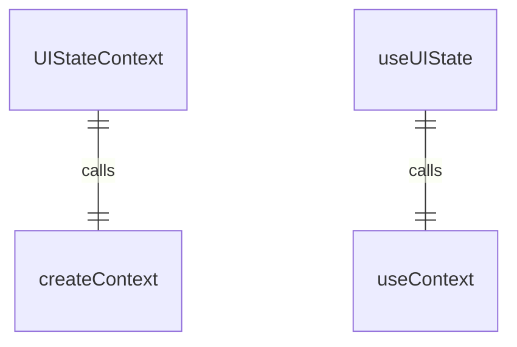
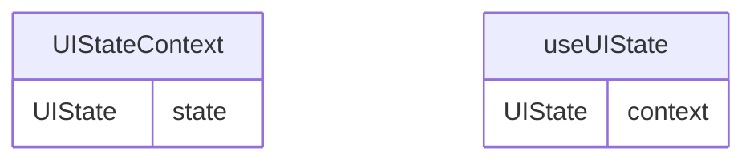

# UIStateContext.tsx

UI状态上下文，用于提供应用程序UI状态信息。

## 功能概述

1. 提供应用程序UI状态对象
2. 实现React Context模式
3. 提供类型安全的UI状态访问

## 接口定义

### ProQuotaDialogRequest
- `failedModel`: 失败的模型名称
- `fallbackModel`: 备用模型名称
- `resolve`: 解决配额请求的函数

### UIState
包含以下UI状态属性：
- `history`: 历史记录项数组
- `isThemeDialogOpen`: 主题对话框是否打开
- `themeError`: 主题错误信息
- `isAuthenticating`: 是否正在认证
- `isConfigInitialized`: 配置是否已初始化
- `authError`: 认证错误信息
- `isAuthDialogOpen`: 认证对话框是否打开
- `editorError`: 编辑器错误信息
- `isEditorDialogOpen`: 编辑器对话框是否打开
- `showPrivacyNotice`: 是否显示隐私声明
- `corgiMode`: 是否为Corgi模式
- `debugMessage`: 调试信息
- `quittingMessages`: 退出消息
- `isSettingsDialogOpen`: 设置对话框是否打开
- `slashCommands`: 斜杠命令数组
- `pendingSlashCommandHistoryItems`: 待处理的斜杠命令历史项
- `commandContext`: 命令上下文
- `shellConfirmationRequest`: Shell确认请求
- `confirmationRequest`: 确认请求
- `geminiMdFileCount`: Gemini Markdown文件数量
- `streamingState`: 流状态
- `initError`: 初始化错误信息
- `pendingGeminiHistoryItems`: 待处理的Gemini历史项
- `thought`: 思考摘要
- `shellModeActive`: Shell模式是否激活
- `userMessages`: 用户消息数组
- `buffer`: 文本缓冲区
- `inputWidth`: 输入宽度
- `suggestionsWidth`: 建议宽度
- `isInputActive`: 输入是否激活
- `shouldShowIdePrompt`: 是否显示IDE提示
- `isFolderTrustDialogOpen`: 文件夹信任对话框是否打开
- `isTrustedFolder`: 是否为受信任文件夹
- `constrainHeight`: 是否约束高度
- `showErrorDetails`: 是否显示错误详情
- `filteredConsoleMessages`: 过滤后的控制台消息
- `ideContextState`: IDE上下文状态
- `showToolDescriptions`: 是否显示工具描述
- `ctrlCPressedOnce`: Ctrl+C是否按过一次
- `ctrlDPressedOnce`: Ctrl+D是否按过一次
- `showEscapePrompt`: 是否显示退出提示
- `isFocused`: 是否聚焦
- `elapsedTime`: 经过的时间
- `currentLoadingPhrase`: 当前加载短语
- `historyRemountKey`: 历史重载键
- `messageQueue`: 消息队列
- `showAutoAcceptIndicator`: 显示自动接受指示器
- `showWorkspaceMigrationDialog`: 是否显示工作区迁移对话框
- `workspaceExtensions`: 工作区扩展
- `userTier`: 用户层级ID
- `proQuotaRequest`: 专业配额请求
- `currentModel`: 当前模型
- `contextFileNames`: 上下文文件名数组
- `errorCount`: 错误计数
- `availableTerminalHeight`: 可用终端高度
- `mainAreaWidth`: 主区域宽度
- `staticAreaMaxItemHeight`: 静态区域最大项高度
- `staticExtraHeight`: 静态额外高度
- `dialogsVisible`: 对话框是否可见
- `pendingHistoryItems`: 待处理的历史项
- `nightly`: 是否为夜间版本
- `branchName`: 分支名称
- `sessionStats`: 会话统计状态
- `terminalWidth`: 终端宽度
- `terminalHeight`: 终端高度
- `mainControlsRef`: 主控引用
- `currentIDE`: 当前IDE
- `updateInfo`: 更新信息
- `showIdeRestartPrompt`: 是否显示IDE重启提示
- `isRestarting`: 是否正在重启

## 导出内容

### UIStateContext
- React Context对象
- 类型为`UIState | null`
- 初始值为null

### useUIState
- 自定义hook，用于访问UI状态上下文
- 包含错误检查，确保在UIStateProvider内使用
- 返回UIState对象

## 使用方式

1. 使用UIStateProvider包装需要访问UI状态的组件
2. 在子组件中使用useUIState hook访问UI状态对象

## 依赖关系

- 依赖 `react` 的 `createContext` 和 `useContext`
- 依赖 `../types.js` 的各种类型
- 依赖 `../commands/types.js` 的命令类型
- 依赖 `../components/shared/text-buffer.js` 的文本缓冲区类型
- 依赖 `@google/gemini-cli-core` 的各种类型
- 依赖 `ink` 的 `DOMElement` 类型
- 依赖 `../contexts/SessionContext.js` 的 `SessionStatsState` 类型
- 依赖 `../utils/updateCheck.js` 的 `UpdateObject` 类型

## 函数级调用关系

## 变量级调用关系

