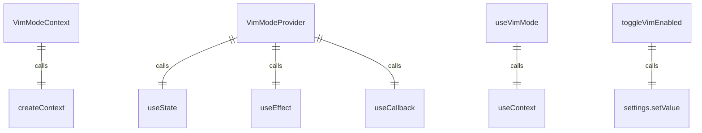
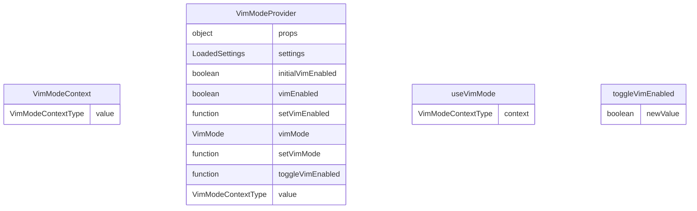

# VimModeContext.tsx

Vim模式上下文，用于管理应用程序的Vim模式状态。

## 功能概述

1. 提供Vim模式启用状态和当前模式
2. 实现Vim模式的切换功能
3. 实现React Context模式
4. 与应用程序设置集成

## 类型定义

### VimMode
- `'NORMAL'`: 正常模式
- `'INSERT'`: 插入模式

### VimModeContextType
- `vimEnabled`: Vim模式是否启用
- `vimMode`: 当前Vim模式
- `toggleVimEnabled`: 切换Vim模式启用状态的函数
- `setVimMode`: 设置Vim模式的函数

## 导出内容

### VimModeContext
- React Context对象
- 类型为`VimModeContextType | undefined`
- 初始值为undefined

### VimModeProvider
- Context Provider组件
- 管理Vim模式状态
- 与应用程序设置集成

### useVimMode
- 自定义hook，用于访问Vim模式上下文
- 包含错误检查，确保在VimModeProvider内使用
- 返回VimModeContextType对象

## 状态管理

### vimEnabled
- 使用`useState`管理Vim模式启用状态
- 从应用程序设置初始化
- 通过`toggleVimEnabled`函数更新

### vimMode
- 使用`useState`管理当前Vim模式
- 当Vim模式启用时默认为'NORMAL'模式
- 通过`setVimMode`函数更新

## 核心功能

### toggleVimEnabled
- 切换Vim模式启用状态
- 更新应用程序设置
- 当启用Vim模式时，自动切换到'NORMAL'模式
- 使用`useCallback`优化性能

### setVimMode
- 设置当前Vim模式
- 直接更新状态

## 事件处理

### 设置同步
- 使用`useEffect`监听应用程序设置变化
- 当设置中的Vim模式选项变化时，同步更新本地状态

## 使用方式

1. 使用VimModeProvider包装需要访问Vim模式的组件
2. 在子组件中使用useVimMode hook访问Vim模式状态和操作函数

## 依赖关系

- 依赖 `react` 的 `createContext`、`useContext`、`useState`、`useCallback`、`useEffect`
- 依赖 `../../config/settings.js` 的 `LoadedSettings` 和 `SettingScope`

## 函数级调用关系

## 变量级调用关系

