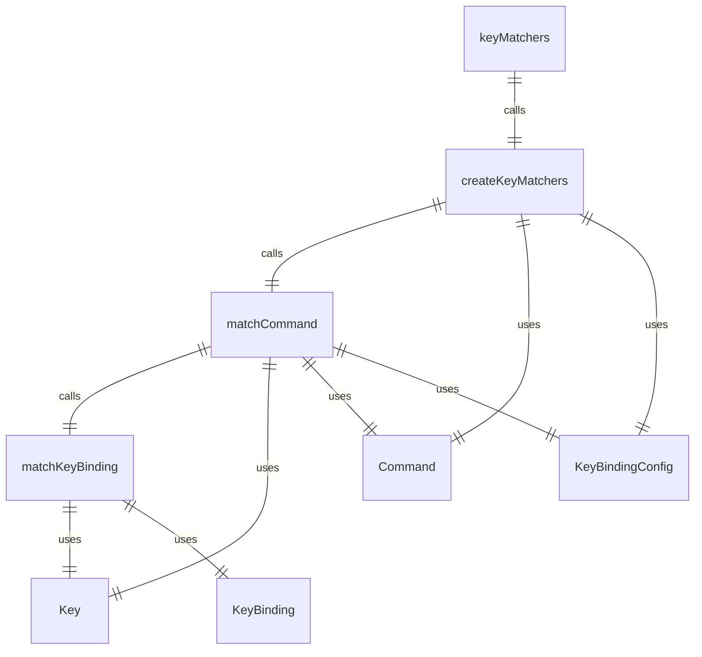
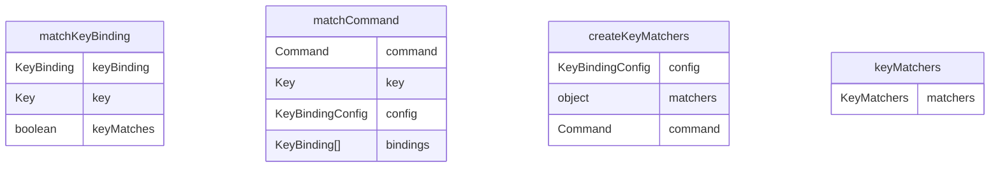

# keyMatchers.ts

这个文件提供了键盘绑定匹配功能，用于将按键事件与命令绑定进行匹配。

## 功能概述

1. 提供 `matchKeyBinding` 函数用于匹配单个键绑定
2. 提供 `matchCommand` 函数用于匹配命令的所有键绑定
3. 提供 `createKeyMatchers` 函数用于创建键匹配器对象
4. 导出默认的键匹配器对象

## 主要函数

### matchKeyBinding
- 将单个 `KeyBinding` 与实际的 `Key` 按键进行匹配
- 支持按键名称或序列匹配
- 支持修饰键（ctrl、shift、command/meta、paste）匹配
- 遵循原始逻辑：undefined 表示忽略该修饰键

### matchCommand
- 检查按键是否匹配命令的任何绑定
- 接受命令、按键和可选的配置参数
- 返回布尔值表示是否匹配

### createKeyMatchers
- 从键绑定配置创建键匹配器对象
- 为每个命令创建对应的匹配器函数
- 返回 `KeyMatchers` 对象

## 类型定义

### KeyMatcher
- 键匹配器函数类型：`(key: Key) => boolean`

### KeyMatchers
- 键匹配器映射到命令枚举的类型
- 只读对象，每个命令都有对应的匹配器函数

## 依赖关系

- 依赖 `./hooks/useKeypress.js` 中的 `Key` 类型
- 依赖 `../config/keyBindings.js` 中的 `KeyBinding`、`KeyBindingConfig` 类型和 `Command` 枚举
- 依赖 `../config/keyBindings.js` 中的 `defaultKeyBindings` 默认配置

## 导出内容

- `keyMatchers`：使用默认配置创建的键匹配器对象
- `Command`：命令枚举（重新导出）
- `createKeyMatchers`：创建键匹配器的函数
- `KeyMatchers`：键匹配器类型

## 函数级调用关系

## 变量级调用关系

