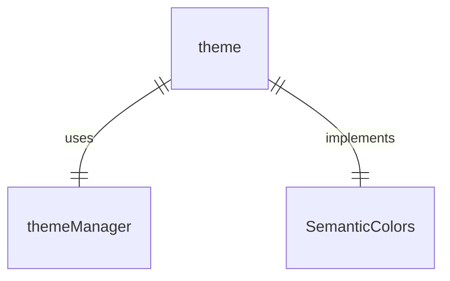
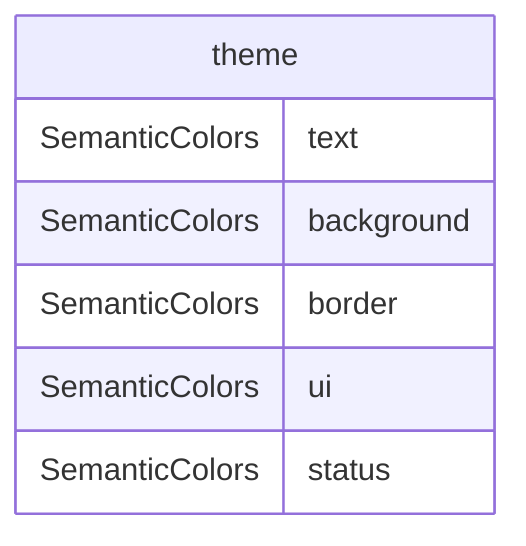

# semantic-colors.ts

这个文件导出了一个语义颜色对象，用于应用程序的 UI 语义颜色管理。

## 功能概述

1. 导出 `theme` 对象作为语义颜色主题
2. 通过主题管理器获取活动主题的语义颜色
3. 提供一致的语义颜色访问接口

## 主要对象

### theme
- 实现 `SemanticColors` 接口
- 通过 `themeManager` 获取活动主题的语义颜色值
- 使用 getter 方法动态获取颜色值

## 依赖关系

- 依赖 `./themes/theme-manager.js` 中的 `themeManager`
- 依赖 `./themes/semantic-tokens.js` 中的 `SemanticColors` 类型

## 语义颜色属性

- `text`：文本颜色
- `background`：背景颜色
- `border`：边框颜色
- `ui`：UI 元素颜色
- `status`：状态颜色

## 函数级调用关系

## 变量级调用关系

