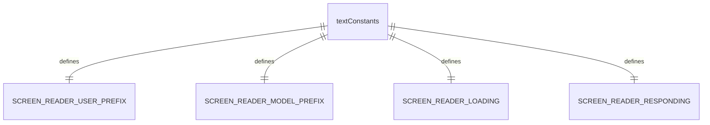
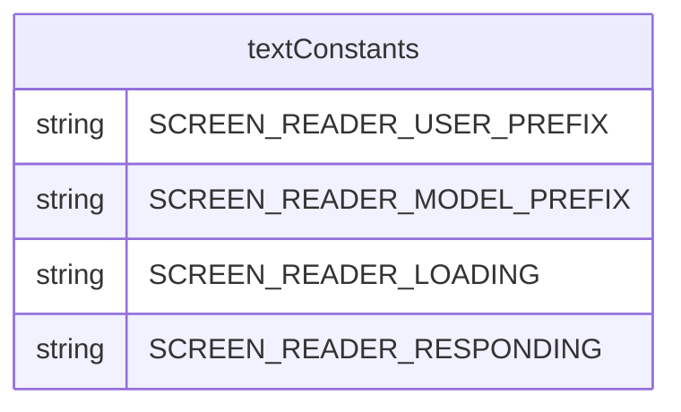

# textConstants.ts

这个文件定义了应用程序 UI 中使用的文本常量，主要用于屏幕阅读器支持。

## 功能概述

1. 定义屏幕阅读器前缀常量
2. 定义状态文本常量

## 常量定义

### 屏幕阅读器前缀
- `SCREEN_READER_USER_PREFIX`：用户消息前缀（"User: "）
- `SCREEN_READER_MODEL_PREFIX`：模型消息前缀（"Model: "）

### 状态文本
- `SCREEN_READER_LOADING`：加载状态文本（"loading"）
- `SCREEN_READER_RESPONDING`：响应状态文本（"responding"）

## 函数级调用关系

## 变量级调用关系

