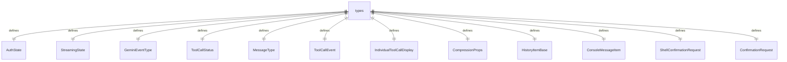

# types.ts

这个文件定义了应用程序 UI 中使用的各种类型和枚举。

## 功能概述

1. 定义认证状态枚举
2. 定义流状态枚举
3. 定义 Gemini 事件类型枚举
4. 定义工具调用状态枚举
5. 定义各种历史记录项类型
6. 定义消息类型枚举和消息类型
7. 定义控制台消息类型
8. 定义斜杠命令处理器结果类型
9. 定义确认请求类型

## 枚举定义

### AuthState
- `Unauthenticated`：未认证状态
- `Updating`：更新认证状态
- `Authenticated`：已认证状态

### StreamingState
- `Idle`：空闲状态
- `Responding`：响应状态
- `WaitingForConfirmation`：等待确认状态

### GeminiEventType
- `Content`：内容事件
- `ToolCallRequest`：工具调用请求事件

### ToolCallStatus
- `Pending`：待处理
- `Canceled`：已取消
- `Confirming`：确认中
- `Executing`：执行中
- `Success`：成功
- `Error`：错误

### MessageType
- `INFO`：信息消息
- `ERROR`：错误消息
- `USER`：用户消息
- `ABOUT`：关于消息
- `HELP`：帮助消息
- `STATS`：统计消息
- `MODEL_STATS`：模型统计消息
- `TOOL_STATS`：工具统计消息
- `QUIT`：退出消息
- `GEMINI`：Gemini 消息
- `COMPRESSION`：压缩消息

## 接口定义

### ToolCallEvent
- 工具调用事件接口
- 包含类型、状态、调用 ID、名称、参数等属性

### IndividualToolCallDisplay
- 单个工具调用显示接口
- 包含调用 ID、名称、描述、状态等属性

### CompressionProps
- 压缩属性接口
- 包含待处理状态、原始令牌数、新令牌数等属性

### HistoryItemBase
- 历史记录项基础接口
- 包含可选的文本内容

### ConsoleMessageItem
- 控制台消息项接口
- 包含类型、内容和计数

### ShellConfirmationRequest
- Shell 确认请求接口
- 包含命令数组和确认回调函数

### ConfirmationRequest
- 确认请求接口
- 包含提示和确认回调函数

## 类型定义

### HistoryItem 类型
- `HistoryItemUser`：用户历史记录项
- `HistoryItemGemini`：Gemini 历史记录项
- `HistoryItemInfo`：信息历史记录项
- `HistoryItemError`：错误历史记录项
- `HistoryItemAbout`：关于历史记录项
- `HistoryItemHelp`：帮助历史记录项
- `HistoryItemToolGroup`：工具组历史记录项
- `HistoryItemStats`：统计历史记录项
- `HistoryItemQuit`：退出历史记录项
- `HistoryItemCompression`：压缩历史记录项

### HistoryItemWithoutId
- 不包含 ID 的历史记录项联合类型

### HistoryItem
- 包含 ID 的历史记录项类型

### Message
- 内部命令反馈使用的简化消息结构

### SubmitPromptResult
- 提交提示结果接口

### SlashCommandProcessorResult
- 斜杠命令处理器结果联合类型

## 依赖关系

- 依赖 `@google/gemini-cli-core` 中的多个类型
- 依赖 `@google/genai` 中的 `PartListUnion` 类型
- 依赖 React 的 `ReactNode` 类型

## 函数级调用关系



## 变量级调用关系

```mermaid
erDiagram
    AuthState {
        string Unauthenticated
        string Updating
        string Authenticated
    }
    StreamingState {
        string Idle
        string Responding
        string WaitingForConfirmation
    }
    GeminiEventType {
        string Content
        string ToolCallRequest
    }
    ToolCallStatus {
        string Pending
        string Canceled
        string Confirming
        string Executing
        string Success
        string Error
    }
    MessageType {
        string INFO
        string ERROR
        string USER
        string ABOUT
        string HELP
        string STATS
        string MODEL_STATS
        string TOOL_STATS
        string QUIT
        string GEMINI
        string COMPRESSION
    }
    ToolCallEvent {
        string type
        ToolCallStatus status
        string callId
        string name
        Record~string,never~ args
        ToolResultDisplay | undefined resultDisplay
        ToolCallConfirmationDetails | undefined confirmationDetails
    }
    IndividualToolCallDisplay {
        string callId
        string name
        string description
        ToolResultDisplay | undefined resultDisplay
        ToolCallStatus status
        ToolCallConfirmationDetails | undefined confirmationDetails
        boolean | undefined renderOutputAsMarkdown
        string | undefined outputFile
    }
    CompressionProps {
        boolean isPending
        number | null originalTokenCount
        number | null newTokenCount
        CompressionStatus | null compressionStatus
    }
    HistoryItemBase {
        string | undefined text
    }
    ConsoleMessageItem {
        "log" | "warn" | "error" | "debug" | "info" type
        string content
        number count
    }
    ShellConfirmationRequest {
        string[] commands
        function onConfirm
    }
    ConfirmationRequest {
        ReactNode prompt
        function onConfirm
    }
```