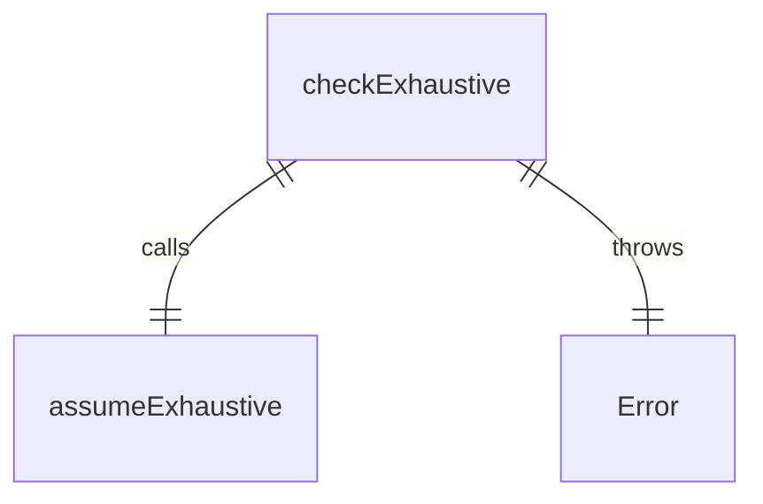
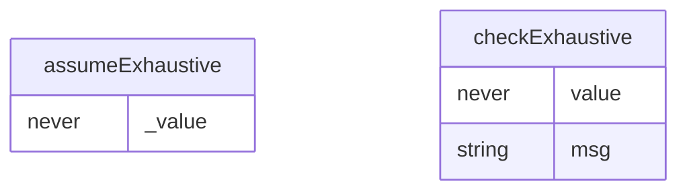

# checks.ts

这个文件定义了用于处理穷尽性检查的工具函数，确保在编译时能够捕获未处理的枚举值或联合类型分支。

## 功能概述

1. 提供穷尽性检查的工具函数
2. 在编译时捕获未处理的枚举值
3. 在运行时抛出异常处理意外值

## 函数结构

### assumeExhaustive
- 接受一个`never`类型的参数
- 不执行任何操作，仅用于编译时检查
- 当传入非`never`类型的值时会导致编译错误

### checkExhaustive
- 接受一个`never`类型的值和可选的错误消息
- 调用`assumeExhaustive`进行编译时检查
- 抛出包含错误消息的异常
- 常用于switch语句的default分支，确保所有枚举值都被处理

## 使用场景

### Switch语句穷尽性检查
```typescript
switch(enumValue) {
  case Enum.A:
  case Enum.B:
    break;
  default:
    checkExhaustive(enumValue);
}
```

## 依赖关系

- 无外部依赖

## 函数级调用关系



## 变量级调用关系

