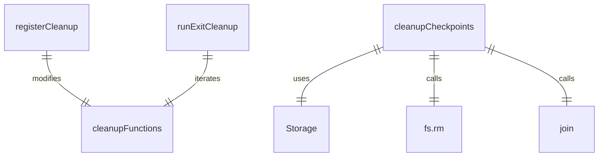
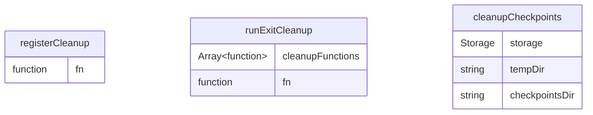

# cleanup.ts

这个文件定义了应用程序退出时的清理功能，包括注册清理函数和执行清理操作。

## 功能概述

1. 提供注册清理函数的机制
2. 执行所有注册的清理函数
3. 清理检查点目录

## 变量结构

### cleanupFunctions
- 存储清理函数的数组
- 支持同步和异步清理函数
- 在执行清理后会被清空

## 函数结构

### registerCleanup
- 接受一个清理函数作为参数
- 将清理函数添加到`cleanupFunctions`数组中
- 支持同步和异步清理函数

### runExitCleanup
- 异步执行所有注册的清理函数
- 忽略执行过程中出现的错误
- 执行完成后清空`cleanupFunctions`数组

### cleanupCheckpoints
- 异步清理检查点目录
- 使用Storage类获取项目临时目录路径
- 删除checkpoints子目录及其所有内容
- 忽略删除过程中出现的错误

## 依赖关系

- 依赖 `node:fs` 的 `promises` 模块进行文件系统操作
- 依赖 `node:path` 的 `join` 函数进行路径拼接
- 依赖 `@google/gemini-cli-core` 的 `Storage` 类

## 函数级调用关系

## 变量级调用关系

