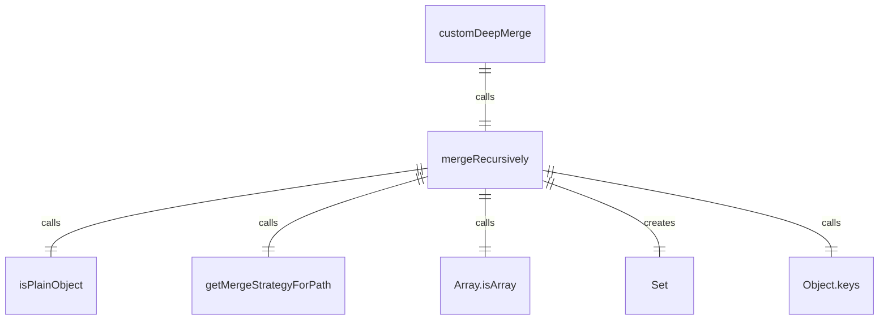
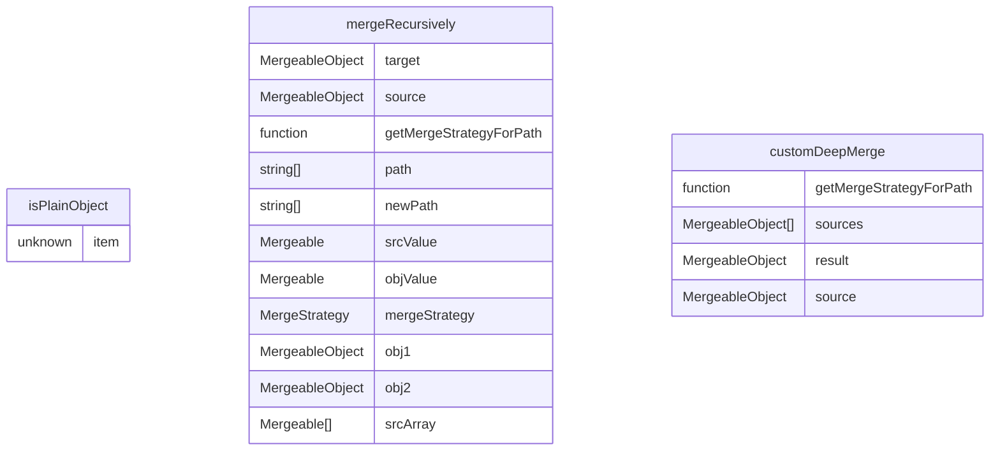

# deepMerge.ts

这个文件实现了一个自定义的深度合并函数，支持不同的合并策略。

## 功能概述

1. 提供自定义深度合并功能
2. 支持多种合并策略（浅合并、连接、并集等）
3. 防止原型污染攻击

## 类型定义

### Mergeable
- 可合并的类型联合：string | number | boolean | null | undefined | object | Mergeable[]

### MergeableObject
- 可合并对象类型：Record<string, Mergeable>

## 函数结构

### isPlainObject
- 检查一个值是否为普通对象
- 排除数组和null值
- 返回类型谓词用于类型保护

### mergeRecursively
- 递归合并两个对象
- 支持不同的合并策略
- 防止原型污染（过滤__proto__、constructor、prototype键）
- 处理数组的特殊合并策略
- 处理对象和基本值的合并

### customDeepMerge
- 主要导出函数，执行自定义深度合并
- 接受合并策略函数和多个源对象
- 返回合并后的对象

## 合并策略

### SHALLOW_MERGE
- 浅合并对象属性
- 使用展开运算符合并两个对象

### CONCAT
- 数组合并策略
- 将源数组连接到目标数组

### UNION
- 数组合并策略
- 创建两个数组元素的并集（去重）

## 安全特性

### 原型污染防护
- 明确过滤危险键名：__proto__、constructor、prototype
- 避免通过合并操作修改对象原型

## 依赖关系

- 依赖 `../config/settingsSchema.js` 的 `MergeStrategy` 枚举

## 函数级调用关系

## 变量级调用关系

