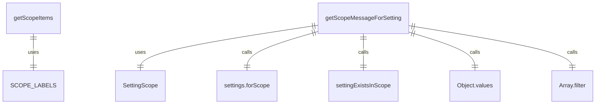
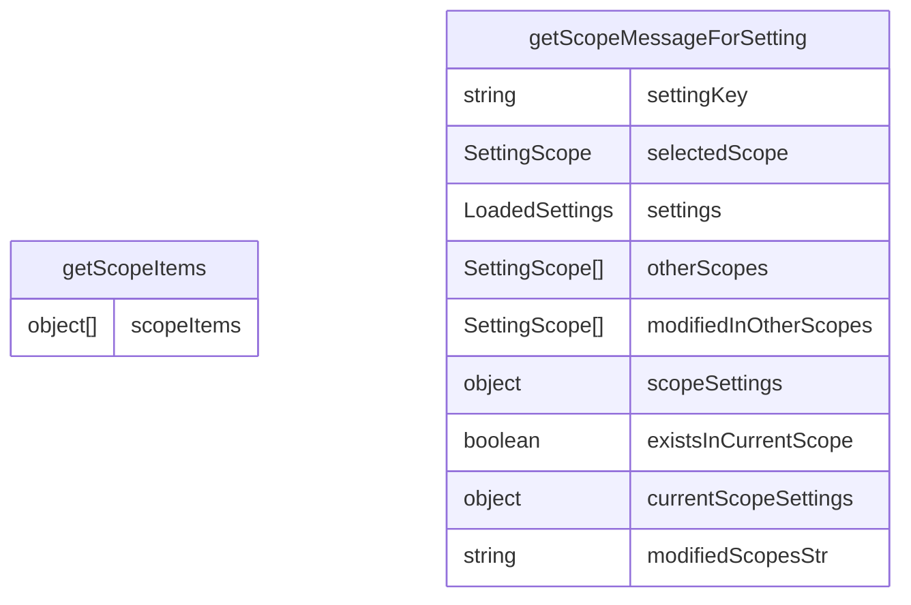

# dialogScopeUtils.ts

这个文件提供了处理设置范围的工具函数，主要用于对话框组件中显示和管理不同级别的设置。

## 功能概述

1. 提供设置范围的标签常量
2. 生成范围选择的选项列表
3. 为特定设置生成范围消息

## 常量结构

### SCOPE_LABELS
- 映射设置范围枚举到用户友好的标签
- User Settings: 用户设置
- Workspace Settings: 工作区设置
- System Settings: 系统设置

## 函数结构

### getScopeItems
- 生成用于单选按钮选择的范围项目列表
- 返回包含标签和值的对象数组
- 用于UI组件中的范围选择

### getScopeMessageForSetting
- 为特定设置生成范围消息
- 检查设置在其他范围中是否被修改
- 根据当前范围和修改状态生成相应的消息
- 消息格式：
  - "(Also modified in ...)" - 当前范围和其他范围都修改了设置
  - "(Modified in ...)" - 仅在其他范围修改了设置

## 依赖关系

- 依赖 `../config/settings.js` 的 `LoadedSettings` 类型和 `SettingScope` 枚举
- 依赖 `./settingsUtils.js` 的 `settingExistsInScope` 函数

## 函数级调用关系

## 变量级调用关系

