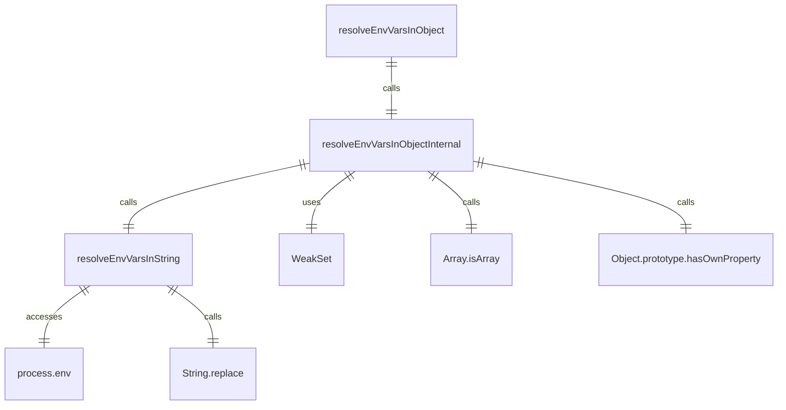
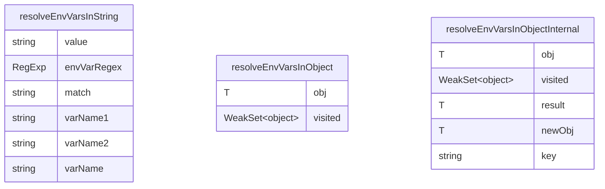

# envVarResolver.ts

这个文件提供了环境变量解析功能，可以在字符串和对象中解析环境变量占位符。

## 功能概述

1. 解析字符串中的环境变量占位符
2. 递归解析对象中的环境变量占位符
3. 支持多种占位符格式
4. 防止循环引用

## 函数结构

### resolveEnvVarsInString
- 解析字符串中的环境变量占位符
- 支持两种格式：$VAR_NAME 和 ${VAR_NAME}
- 如果环境变量未定义，保留原始占位符
- 使用正则表达式匹配和替换占位符

### resolveEnvVarsInObject
- 递归解析对象中的环境变量占位符
- 处理字符串、数组、嵌套对象和其他基本类型
- 使用WeakSet防止循环引用
- 调用内部实现函数

### resolveEnvVarsInObjectInternal
- resolveEnvVarsInObject的内部实现
- 处理循环引用保护
- 递归处理不同类型的值
- 对于对象和数组，创建新实例以避免修改原始对象

## 占位符格式

### $VAR_NAME
- 简单格式，适用于简单的变量名

### ${VAR_NAME}
- 大括号格式，更明确的边界

## 循环引用保护

### WeakSet跟踪
- 使用WeakSet跟踪已访问的对象
- 防止在递归解析过程中出现无限循环
- 检测到循环引用时返回浅拷贝

## 依赖关系

- 依赖Node.js的`process.env`对象访问环境变量
- 无其他外部依赖

## 函数级调用关系

## 变量级调用关系

