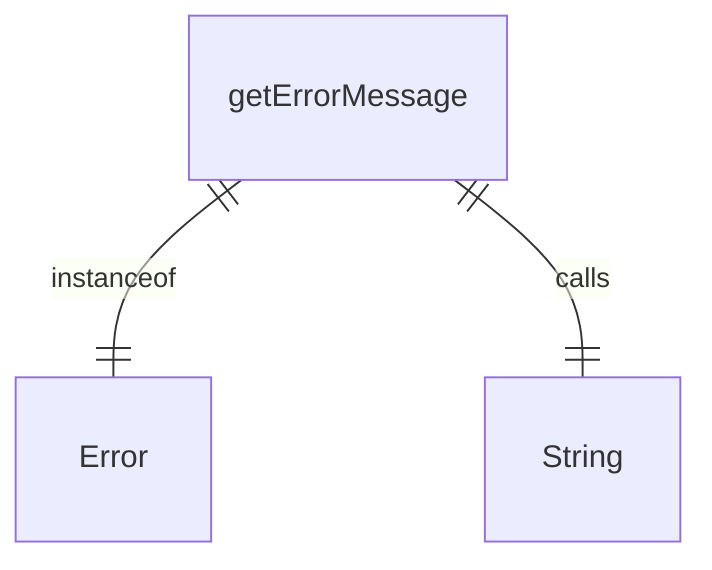
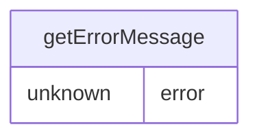

# errors.ts

这个文件提供了一个工具函数，用于安全地获取错误消息。

## 功能概述

1. 提供统一的错误消息获取方式
2. 处理不同类型的错误对象
3. 确保始终返回字符串格式的错误消息

## 函数结构

### getErrorMessage
- 接受任意类型的错误参数
- 检查是否为Error实例
- 如果是Error实例，返回其message属性
- 如果不是Error实例，使用String()函数转换为字符串

## 使用场景

### 错误处理
- 在catch块中安全地获取错误消息
- 统一处理不同来源的错误
- 避免直接访问错误对象属性可能引发的问题

## 依赖关系

- 无外部依赖

## 函数级调用关系

## 变量级调用关系

