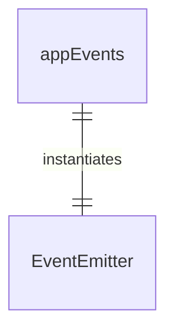
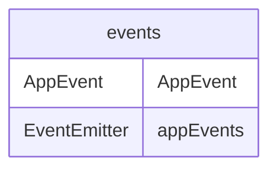

# events.ts

这个文件定义了应用程序级别的事件枚举和事件发射器。

## 功能概述

1. 定义应用程序事件类型
2. 提供全局事件发射器实例

## 枚举结构

### AppEvent
- 应用程序事件类型枚举
- OpenDebugConsole: 打开调试控制台事件
- LogError: 记录错误事件

## 导出内容

### appEvents
- 全局EventEmitter实例
- 用于在应用程序中发射和监听事件
- 基于Node.js的EventEmitter实现

## 使用场景

### 事件驱动架构
- 组件间解耦通信
- 全局事件处理
- 调试和错误日志记录

## 依赖关系

- 依赖 `node:events` 的 `EventEmitter`

## 函数级调用关系

## 变量级调用关系

