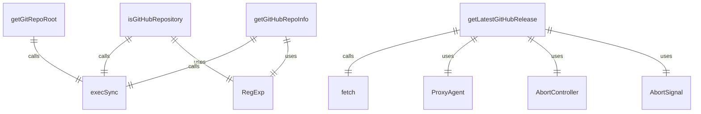
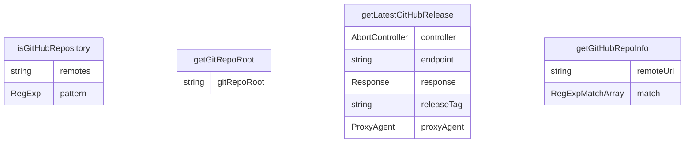

# gitUtils.ts

这个文件提供了一系列Git相关的工具函数，用于检查Git仓库状态和获取仓库信息。

## 功能概述

1. 检查目录是否为GitHub仓库
2. 获取Git仓库根目录
3. 获取GitHub最新发布版本
4. 提取GitHub仓库信息

## 函数结构

### isGitHubRepository
- 检查当前目录是否为GitHub仓库
- 执行`git remote -v`命令获取远程仓库信息
- 使用正则表达式检查是否包含github.com
- 发生错误时返回false

### getGitRepoRoot
- 获取Git仓库的根目录路径
- 执行`git rev-parse --show-toplevel`命令
- 验证返回结果非空
- 为空时抛出错误

### getLatestGitHubRelease
- 异步获取GitHub仓库的最新发布版本标签
- 支持代理配置
- 使用GitHub API获取最新发布信息
- 设置30秒超时
- 验证响应包含tag_name字段
- 失败时抛出错误

### getGitHubRepoInfo
- 获取GitHub仓库的所有者和仓库名
- 执行`git remote get-url origin`命令获取远程URL
- 使用正则表达式解析URL提取所有者和仓库名
- 支持HTTPS和SSH格式的URL
- 解析失败时抛出错误

## 依赖关系

- 依赖 `node:child_process` 的 `execSync` 执行Git命令
- 依赖 `undici` 的 `ProxyAgent` 支持代理请求

## 函数级调用关系

## 变量级调用关系

