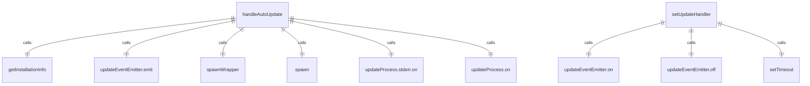

# handleAutoUpdate.ts

这个文件处理应用程序的自动更新功能，包括执行更新命令和处理更新事件。

## 功能概述

1. 执行自动更新命令
2. 处理更新事件和用户通知
3. 管理更新过程中的错误处理

## 函数结构

### handleAutoUpdate
- 处理自动更新逻辑
- 检查更新信息和设置
- 获取安装信息
- 执行更新命令
- 监听更新过程事件
- 发射更新结果事件

### setUpdateHandler
- 设置更新事件处理器
- 处理更新接收、失败、成功等事件
- 向用户界面添加更新消息
- 管理事件监听器的注册和注销

## 更新事件

### update-received
- 接收到更新信息时触发
- 显示更新消息给用户

### update-success
- 更新成功时触发
- 通知用户更新成功

### update-failed
- 更新失败时触发
- 通知用户更新失败并提供错误信息

### update-info
- 更新信息事件
- 显示一般性更新信息

## 依赖关系

- 依赖 `../ui/utils/updateCheck.js` 的 `UpdateObject` 类型
- 依赖 `../config/settings.js` 的 `LoadedSettings` 类型
- 依赖 `./installationInfo.js` 的 `getInstallationInfo` 函数
- 依赖 `./updateEventEmitter.js` 的 `updateEventEmitter`
- 依赖 `../ui/types.js` 的 `HistoryItem` 和 `MessageType`
- 依赖 `./spawnWrapper.js` 的 `spawnWrapper`
- 依赖 `node:child_process` 的 `spawn` 类型

## 函数级调用关系



## 变量级调用关系

```mermaid
erDiagram
    handleAutoUpdate {
        UpdateObject info
        LoadedSettings settings
        string projectRoot
        typeof spawn spawnFn
        object installationInfo
        string combinedMessage
        boolean isNightly
        string updateCommand
        ReturnType~typeof spawn~ updateProcess
        string errorOutput
        number code
        Error err
    }
    setUpdateHandler {
        function addItem
        function setUpdateInfo
        boolean successfullyInstalled
        function handleUpdateRecieved
        function handleUpdateFailed
        function handleUpdateSuccess
        function handleUpdateInfo
        UpdateObject info
        string savedMessage
        object data
    }
```