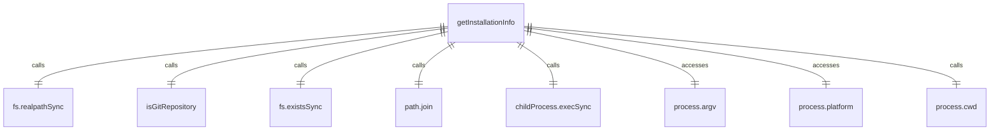
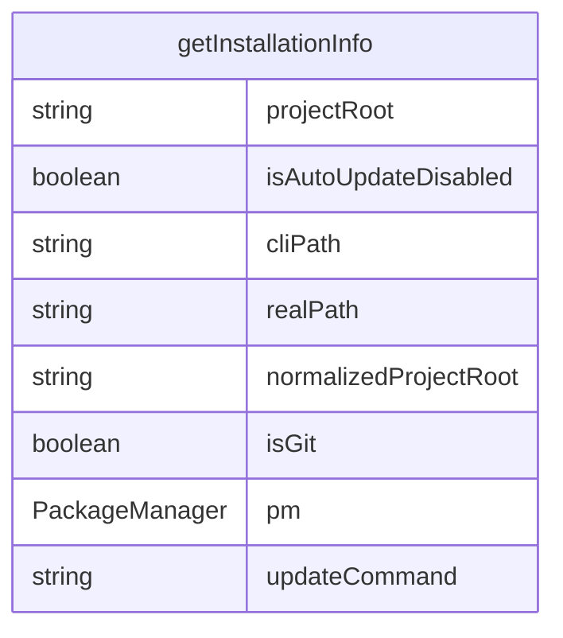

# installationInfo.ts

这个文件用于检测应用程序的安装信息，包括包管理器类型、安装位置和更新命令。

## 功能概述

1. 检测应用程序的安装方式
2. 识别使用的包管理器
3. 提供相应的更新命令和消息
4. 判断是否为全局安装

## 枚举结构

### PackageManager
- NPM: npm包管理器
- YARN: yarn包管理器
- PNPM: pnpm包管理器
- PNPX: pnpx执行器
- BUN: bun包管理器
- BUNX: bunx执行器
- HOMEBREW: Homebrew包管理器
- NPX: npx执行器
- UNKNOWN: 未知包管理器

## 接口结构

### InstallationInfo
- packageManager: 包管理器类型
- isGlobal: 是否为全局安装
- updateCommand: 更新命令（可选）
- updateMessage: 更新消息（可选）

## 函数结构

### getInstallationInfo
- 检测应用程序的安装信息
- 分析命令行参数路径
- 检查不同安装方式：
  - 本地git克隆
  - npx/pnpx执行
  - Homebrew安装
  - pnpm全局安装
  - yarn全局安装
  - bun安装
  - 本地项目安装
  - npm全局安装
- 返回安装信息对象

## 检测逻辑

### 本地Git克隆
- 检查是否在Git仓库中运行
- 验证路径是否在项目根目录内
- 确保不在node_modules目录中

### NPX/PNPX执行
- 检查路径是否包含npx或pnpx缓存目录

### Homebrew安装
- 仅在macOS平台上检测
- 执行brew list命令检查是否安装

### PNPM/YARN/BUN全局安装
- 检查路径是否包含相应包管理器的全局目录

### 本地项目安装
- 检查路径是否在项目node_modules中
- 检查项目锁文件确定包管理器

### NPM全局安装
- 默认假设为npm全局安装

## 依赖关系

- 依赖 `@google/gemini-cli-core` 的 `isGitRepository` 函数
- 依赖 `node:fs` 的文件系统操作
- 依赖 `node:path` 的路径操作
- 依赖 `node:child_process` 的子进程操作

## 函数级调用关系

## 变量级调用关系

