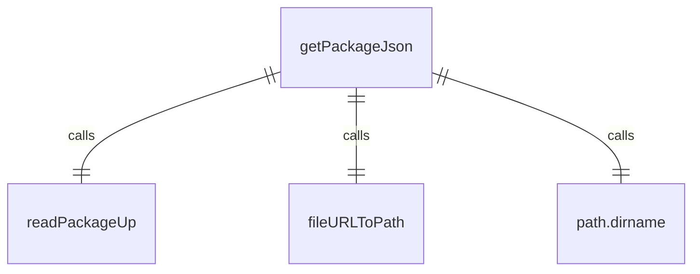
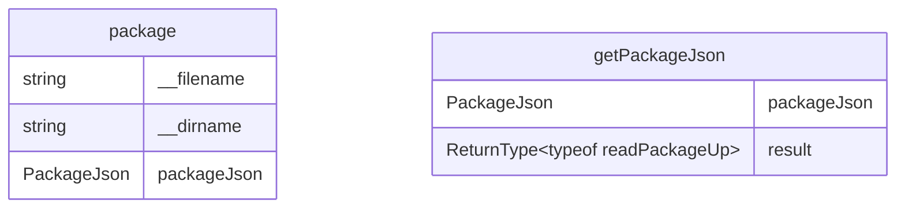

# package.ts

这个文件提供了一个异步函数来获取项目的package.json文件内容。

## 功能概述

1. 读取项目的package.json文件
2. 缓存package.json内容以提高性能
3. 扩展基础PackageJson类型以包含自定义配置

## 类型定义

### PackageJson
- 扩展自read-package-up的BasePackageJson类型
- 添加config字段，包含sandboxImageUri等配置选项

## 变量结构

### __filename
- 当前模块的文件路径
- 使用fileURLToPath将import.meta.url转换为文件路径

### __dirname
- 当前模块的目录路径
- 使用path.dirname获取目录路径

### packageJson
- 缓存的package.json内容
- 避免重复读取文件

## 函数结构

### getPackageJson
- 异步获取package.json内容
- 首先检查缓存，如果存在则直接返回
- 使用readPackageUp从当前目录向上查找package.json
- 找到后缓存内容并返回
- 如果未找到则返回undefined

## 依赖关系

- 依赖 `read-package-up` 的 `readPackageUp` 函数和 `BasePackageJson` 类型
- 依赖 `node:url` 的 `fileURLToPath` 函数
- 依赖 `node:path` 的 `dirname` 函数

## 函数级调用关系

## 变量级调用关系

