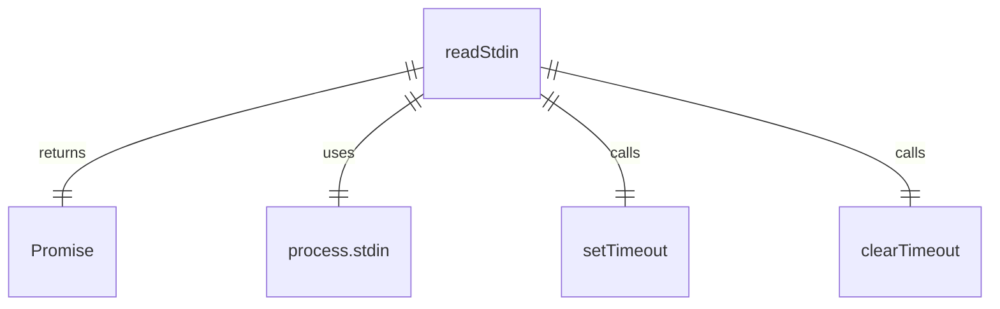

# readStdin.ts

这个文件定义了一个函数，用于从标准输入读取数据。

## 功能概述

1. 从标准输入读取数据
2. 限制读取数据的大小为8MB
3. 处理超时情况，避免程序卡住

## 函数结构

### readStdin
- 返回一个 Promise，解析为从标准输入读取的字符串
- 设置最大读取大小为8MB
- 使用定时器处理超时情况
- 监听 `readable`、`end` 和 `error` 事件
- 在 `readable` 事件中读取数据块
- 如果数据大小超过限制，则截断数据并发出警告
- 在 `end` 事件中解析 Promise
- 在 `error` 事件中拒绝 Promise

## 依赖关系

- 依赖 Node.js 的 `process` 对象

## 函数级调用关系



## 变量级调用关系

```mermaid
erDiagram
    readStdin {
        number MAX_STDIN_SIZE
        string data
        number totalSize
        NodeJS.Timeout pipedInputTimerId
        function onReadable
        function onEnd
        function onError
        function cleanup
    }
```