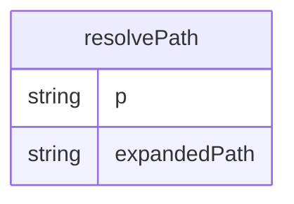

# resolvePath.ts

这个文件提供了一个路径解析函数，支持用户主目录的快捷方式。

## 功能概述

1. 解析路径中的用户主目录快捷方式
2. 支持Windows和Unix风格的主目录表示
3. 标准化路径格式

## 函数结构

### resolvePath
- 接受一个路径字符串作为参数
- 处理空路径，直接返回空字符串
- 处理Windows风格的主目录表示（%USERPROFILE%）
- 处理Unix风格的主目录表示（~）
- 使用path.normalize标准化路径格式

## 路径解析规则

### Windows风格
- 检测路径是否以%USERPROFILE%开头（不区分大小写）
- 替换为os.homedir()返回的实际主目录路径

### Unix风格
- 检测路径是否为~或以~/开头
- 替换为os.homedir()返回的实际主目录路径

## 依赖关系

- 依赖 `node:os` 的 `homedir` 函数获取用户主目录
- 依赖 `node:path` 的 `normalize` 函数标准化路径

## 函数级调用关系

## 变量级调用关系

