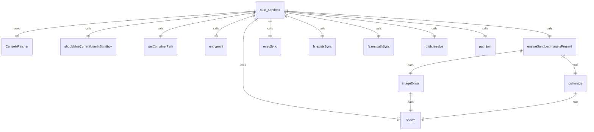
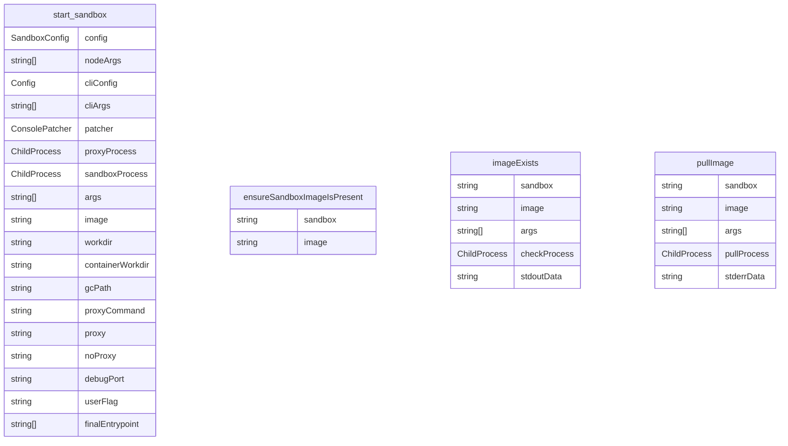

# sandbox.ts

这个文件实现了沙盒功能，用于在隔离环境中运行应用程序，支持Docker和macOS Seatbelt两种沙盒模式。

## 功能概述

1. 启动和管理沙盒环境
2. 支持Docker和Podman容器化沙盒
3. 支持macOS Seatbelt沙盒
4. 处理文件系统挂载和环境变量传递
5. 管理网络配置和代理设置
6. 构建自定义沙盒镜像

## 核心函数

### start_sandbox
- 主要导出函数，启动沙盒环境
- 支持两种模式：sandbox-exec（macOS Seatbelt）和容器化沙盒
- 处理环境变量、文件挂载、网络配置等
- 管理代理进程和沙盒进程的生命周期

### ensureSandboxImageIsPresent
- 确保沙盒镜像存在
- 检查本地是否存在镜像
- 如果不存在则尝试拉取镜像

## 辅助函数

### getContainerPath
- 将主机路径转换为容器内路径
- 处理Windows路径格式转换

### shouldUseCurrentUserInSandbox
- 确定是否在沙盒中使用当前用户的UID/GID
- 特别处理Debian/Ubuntu Linux系统

### parseImageName
- 解析镜像名称，用于容器命名

### ports
- 获取环境变量中指定的端口列表

### entrypoint
- 构造容器入口点命令
- 处理环境变量和路径设置

## 常量定义

### LOCAL_DEV_SANDBOX_IMAGE_NAME
- 本地开发沙盒镜像名称

### SANDBOX_NETWORK_NAME
- 沙盒网络名称

### SANDBOX_PROXY_NAME
- 沙盒代理名称

### BUILTIN_SEATBELT_PROFILES
- 内置macOS Seatbelt配置文件列表

## 沙盒模式

### 容器化沙盒（Docker/Podman）
- 支持自定义Dockerfile
- 挂载工作目录、用户设置目录、临时目录等
- 处理环境变量传递
- 支持网络端口映射
- 支持代理配置

### macOS Seatbelt沙盒
- 使用macOS原生沙盒机制
- 支持多种内置配置文件
- 支持自定义配置文件

## 环境变量支持

### 沙盒配置
- SANDBOX_SET_UID_GID: 控制是否使用当前用户UID/GID
- SANDBOX_PORTS: 暴露的端口列表
- SANDBOX_FLAGS: 自定义沙盒标志
- SANDBOX_MOUNTS: 额外挂载路径
- SANDBOX_ENV: 额外环境变量

### 代理配置
- GEMINI_SANDBOX_PROXY_COMMAND: 代理命令
- HTTPS_PROXY/HTTP_PROXY: 代理设置
- NO_PROXY: 不使用代理的地址列表

### 调试配置
- DEBUG: 调试模式
- DEBUG_PORT: 调试端口

## 依赖关系

- 依赖 `node:child_process` 的 `exec`、`execSync`、`spawn`
- 依赖 `node:os` 的系统信息获取
- 依赖 `node:path` 的路径操作
- 依赖 `node:fs` 和 `node:fs/promises` 的文件操作
- 依赖 `node:url` 的URL处理
- 依赖 `shell-quote` 的命令行参数处理
- 依赖 `../config/settings.js` 的设置目录常量
- 依赖 `node:util` 的 `promisify`
- 依赖 `@google/gemini-cli-core` 的配置和错误类型
- 依赖 `../ui/utils/ConsolePatcher.js` 的控制台补丁

## 函数级调用关系

## 变量级调用关系

