# settingsUtils.ts

这个文件提供了一系列用于处理应用程序设置的工具函数，包括设置验证、获取、修改和显示等功能。

## 功能概述

1. 扁平化设置模式以简化查找
2. 按类别分组设置
3. 获取设置定义和默认值
4. 检查设置是否需要重启
5. 递归获取和设置嵌套对象值
6. 管理设置修改和保存
7. 提供设置显示值和继承状态检查

## 核心概念

### 扁平化模式
- 将嵌套的设置模式转换为扁平结构
- 使用点号分隔的键进行访问
- 提高查找效率

### 设置继承
- 支持多级设置范围（用户、工作区、系统）
- 从当前范围向上继承设置值
- 优先使用当前范围的值

### 设置修改管理
- 跟踪修改的设置
- 支持暂存修改
- 保存修改到适当范围

## 主要函数类别

### 模式操作函数
- getFlattenedSchema: 获取扁平化模式
- getSettingsByCategory: 按类别获取设置
- getSettingDefinition: 获取设置定义
- getAllSettingKeys: 获取所有设置键

### 设置值操作函数
- getEffectiveValue: 获取有效值（考虑继承）
- getDefaultValue: 获取默认值
- getNestedValue: 递归获取嵌套值
- setNestedValue: 递归设置嵌套值

### 设置属性检查函数
- requiresRestart: 检查设置是否需要重启
- isValidSettingKey: 验证设置键是否有效
- shouldShowInDialog: 检查设置是否应在对话框中显示

### 设置修改管理函数
- getSettingValue: 获取设置值
- isSettingModified: 检查设置是否被修改
- setPendingSettingValue: 设置暂存值
- saveModifiedSettings: 保存修改的设置

### 显示和状态函数
- getDisplayValue: 获取显示值
- isDefaultValue: 检查是否为默认值
- isValueInherited: 检查值是否继承
- getEffectiveDisplayValue: 获取显示的有效值

## 数据结构

### FlattenedSchema
- 扁平化的设置模式类型
- 键为点号分隔的路径
- 值为设置定义和键的组合

### SettingDefinition
- 设置定义接口
- 包含类型、默认值、类别等信息

## 依赖关系

- 依赖 `../config/settings.js` 的设置类型
- 依赖 `../config/settingsSchema.js` 的模式类型和函数
- 依赖Node.js的内置功能

## 函数级调用关系

## 变量级调用关系

```mermaid
erDiagram
    flattenSchema {
        SettingsSchema schema
        string prefix
        FlattenedSchema result
        string key
        string newKey
        SettingDefinition definition
    }
    getFlattenedSchema {
        FlattenedSchema _FLATTENED_SCHEMA
    }
    getSettingsByCategory {
        Record~string, Array~SettingDefinition~~ categories
        SettingDefinition definition
        string category
    }
    getEffectiveValue {
        string key
        Settings settings
        Settings mergedSettings
        SettingDefinition definition
        string[] path
        unknown value
    }
    getSettingValue {
        string key
        Settings settings
        Settings mergedSettings
        SettingDefinition definition
        SettingsValue value
        SettingsValue defaultValue
    }
    setPendingSettingValue {
        string key
        boolean value
        Settings pendingSettings
        string[] path
        Settings newSettings
    }
    saveModifiedSettings {
        Set~string~ modifiedSettings
        Settings pendingSettings
        LoadedSettings loadedSettings
        SettingScope scope
        string settingKey
        string[] path
        unknown value
        boolean existsInOriginalFile
        boolean isDefaultValue
    }
    getDisplayValue {
        string key
        Settings settings
        Settings _mergedSettings
        Set~string~ modifiedSettings
        Settings pendingSettings
        SettingDefinition definition
        SettingsValue value
        SettingsValue defaultValue
        string valueString
        boolean isChangedFromDefault
        boolean isInModifiedSettings
    }
```

