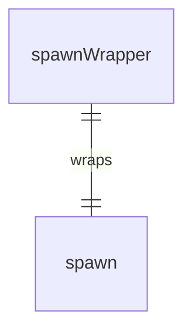

# spawnWrapper.ts

这个文件提供了一个spawn函数的包装器，主要用于测试和模块化。

## 功能概述

1. 导出Node.js的spawn函数
2. 提供统一的spawn函数接口
3. 支持在测试中进行模拟

## 导出内容

### spawnWrapper
- 包装Node.js child_process模块的spawn函数
- 保持与原始spawn函数相同的签名和行为
- 便于在其他模块中使用和测试

## 使用场景

### 测试模拟
- 在单元测试中可以轻松模拟spawn函数
- 避免直接调用系统命令
- 提高测试的可控性和可靠性

### 模块化
- 提供统一的spawn函数接口
- 便于在不同模块间共享
- 简化依赖管理

## 依赖关系

- 依赖 `node:child_process` 的 `spawn` 函数

## 函数级调用关系



## 变量级调用关系

```mermaid
erDiagram
    spawnWrapper {
        typeof spawn spawnWrapper
    }
```