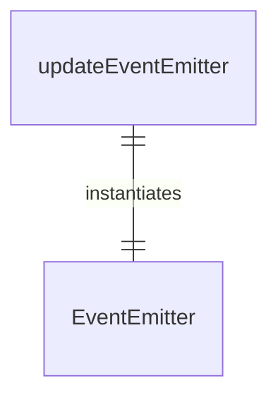
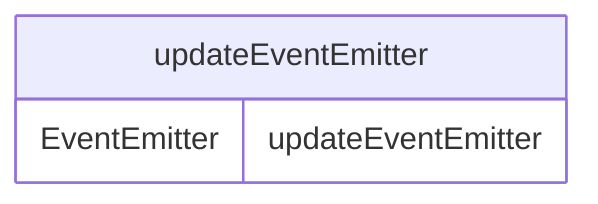

# updateEventEmitter.ts

这个文件定义了一个共享的事件发射器，用于应用程序内不同模块间的解耦通信。

## 功能概述

1. 提供应用程序范围的事件通信机制
2. 支持不同模块间的解耦通信
3. 基于Node.js EventEmitter实现

## 导出内容

### updateEventEmitter
- EventEmitter实例
- 用于在应用程序内发射和监听事件
- 提供模块间通信的中心枢纽

## 使用场景

### 更新通知
- 自动更新过程中的状态通知
- 更新成功或失败的消息传递
- 进度更新和用户提示

### 模块间通信
- 不同功能模块间的事件传递
- 避免模块间的直接依赖
- 提高代码的模块化程度

## 依赖关系

- 依赖 `node:events` 的 `EventEmitter`

## 函数级调用关系

## 变量级调用关系

